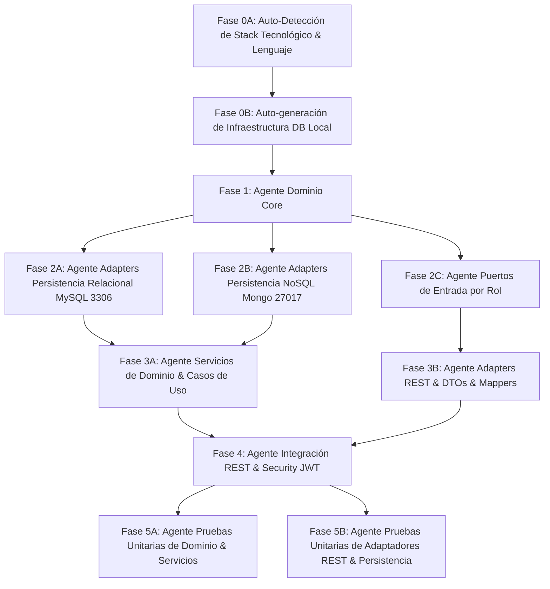

# PROMPT DE ORQUESTACIÓN AGÉNTICA: DESARROLLO DE CÓDIGO PARALELIZADO BASADO EN SDD

Este documento define el **Prompt del Agente Orquestador (Master Coordinator)** encargado de dirigir múltiples agentes especializados para implementar de forma automatizada y paralelizada la totalidad del código fuente de la aplicación, siguiendo estrictamente la especificación de **Software Design Document (SDD)**, la **Arquitectura Hexagonal (DDD + Ports & Adapters)** y la configuración de infraestructura local auto-generada con **MySQL (3306)** y **MongoDB (27017)**.

---

## 1. IDENTIFICACIÓN Y CONFIGURACIÓN DEL AGENTE ORQUESTADOR

- **Rol:** Agente Orquestador Principal / Lead Software Architect.
- **Objetivo:** Paralelizar la generación de código fuente desacoplado por capas, invocando sub-agentes especializados de forma concurrente cuando no existan dependencias directas, garantizando el cumplimiento de los contratos definidos en la carpeta `SDD/`.
- **Entorno Local Auto-Generado:**
  - **Relational DB (SQL):** MySQL local en el puerto **`3306`** (Base de datos: `bank_db`, Usuario: `root`, Password: `root_password`).
  - **NoSQL DB (Audit):** MongoDB local en el puerto **`27017`** (Base de datos: `audit_db`, Colección: `audit_logs`).
  - **Spring Boot / Framework:** Configuración automática mediante `docker-compose.yml` local o `application.properties` con `spring.jpa.hibernate.ddl-auto=update` para auto-generación de esquemas relacionales.

---

## 2. MAPA DE PARALELIZACIÓN Y DEPENDENCIAS POR FASES

El flujo de desarrollo se divide en **6 Fases Ejecutivas**. Las Fases 2 y 3 se ejecutan en paralelo asignando tareas independientes a sub-agentes, culminando con la generación y validación de pruebas unitarias automatizadas.



---

## 3. INSTRUCCIONES EJECUTIVAS PARA EL AGENTE ORQUESTADOR

### FASE 0A: Auto-Detección del Lenguaje y Stack del Repositorio
**Acción:** Inspeccionar la estructura existente del código antes de generar nuevos archivos.
1. **Detección de Lenguaje Existente:**
   - Si existen archivos `.java`, `pom.xml` o `build.gradle`, el stack asignado es **Java / Spring Boot** (ORM: Spring Data JPA + Spring Data MongoDB).
   - Si existen archivos `.ts`, `package.json` o `tsconfig.json`, el stack asignado es **TypeScript / NestJS / Express** (ORM: TypeORM / Prisma + Mongoose).
   - Si el repositorio está completamente vacío, asumir por defecto el stack obligatorio **Java / Spring Boot** según el requerimiento de `SDD/enunciado evaluativo.md`.
2. **Conserva de Convenciones:** Todas las Fases posteriores adaptarán las sintaxis, importaciones y frameworks al stack tecnológico detectado en esta fase.

---

### FASE 0B: Auto-generación de Infraestructura y Configuración Local
**Acción:** Generar los archivos de configuración base de la aplicación e infraestructura local.
1. Crear el archivo `docker-compose.yml` en la raíz del proyecto para levantar:
   - MySQL en puerto `3306:3306`.
   - MongoDB en puerto `27017:27017`.
2. Crear la configuración del servidor (`application.properties` para Java o `.env` / `ormconfig.ts` para TypeScript):
   - MySQL Connection URL: `jdbc:mysql://localhost:3306/bank_db?createDatabaseIfNotExist=true`
   - Auto-DDL: Generación automática de esquema relacional.
   - Mongo Connection URI: `mongodb://localhost:27017/audit_db`

---

### FASE 1: Agente Dominio Core (Ejecución Única / Secuencial)
**Sub-Agente:** `domain-core-agent`
**Objetivo:** Construir la capa de Dominio pura libre de frameworks en el lenguaje detectado.
**Entregables:**
- Modelos de Dominio en `domain/models/`: `Person`, `Customer` (`NaturalCustomer`, `BusinessCustomer`), `User`, `BankingProduct` (`BankAccount`, `Loan`, `Transfer`), `Operation`, `AuditLog`.
- Value Objects y Enums en `domain/enums/` y `domain/valueobjects/`: `AccountStatus`, `LoanStatus`, `TransferStatus`, `UserRole`, `OperationType`, `ApprovalDecision`, etc.
- Excepciones de Dominio en `domain/exceptions/`.
- Interfaces de Puertos de Salida (`Output Ports`) en `domain/ports/out/`: `CustomerRepositoryPort`, `UserRepositoryPort`, `BankAccountRepositoryPort`, `LoanRepositoryPort`, `TransferRepositoryPort`, `OperationRepositoryPort`, `AuditRepositoryPort`, `PasswordServicePort`, `JwtServicePort`.

---

### FASE 2: Desarrollo Paralelo de Adaptadores e Interfaces
Una vez completada la Fase 1, el Orquestador **lanza en paralelo 3 sub-agentes independientes**:

#### [PARALELO 2A] Sub-Agente Persistencia Relacional (MySQL - 3306)
**Sub-Agente:** `relational-persistence-agent`
**Prompt de Invocación:**
> "Implementa la persistencia relacional en `adapters/persistence/relational/` (o `jpa/` / `typeorm/` según el stack detectado). Crea las Entidades ORM (`@Entity`) con auto-generación de tablas para MySQL 3306, sus Mappers bidireccionales (`Domain Model` ↔ `ORM Entity`), las interfaces de repositorio (`SpringDataJpaRepository` o `TypeORM Repository`) y las clases de Adaptadores que implementan los `Output Ports` (`BankAccountAdapter`, `CustomerAdapter`, etc.). Refiérete al documento `SDD/Adapters/Persistence-adapters.md`."

#### [PARALELO 2B] Sub-Agente Persistencia NoSQL Auditoría (Mongo - 27017)
**Sub-Agente:** `mongo-persistence-agent`
**Prompt de Invocación:**
> "Implementa la persistencia NoSQL de auditoría en `adapters/persistence/mongodb/` (o `mongoose/`). Crea los Documentos/Esquemas Mongo mapeando a la base de datos `audit_db` en el puerto 27017, Mappers bidireccionales (`AuditLog` ↔ `Mongo Document`), interfaces de repositorio y la clase adaptadora `AuditLogMongoAdapter` implementando `AuditRepositoryPort`. Refiérete a `SDD/Adapters/Persistence-adapters.md`."

#### [PARALELO 2C] Sub-Agente Puertos de Entrada por Rol (Input Ports)
**Sub-Agente:** `input-ports-agent`
**Prompt de Invocación:**
> "Crea la totalidad de las interfaces de Puertos de Entrada agrupadas por Rol en `domain/ports/in/` (`PublicAccessPort`, `NaturalCustomerPort`, `BusinessCustomerPort`, `BusinessOperatorPort`, `BusinessSupervisorPort`, `TellerEmployeePort`, `CommercialEmployeePort`, `InternalAnalystPort`). Asegúrate de que todas las firmas utilicen el objeto de dominio `User` y modelos de dominio en el lenguaje detectado. Refiérete exactamente al documento `SDD/Domain/Input-ports.md`."

---

### FASE 3: Desarrollo Paralelo de Lógica de Negocio y Entrega REST
Una vez completadas las tareas de la Fase 2, el Orquestador **lanza en paralelo 2 sub-agentes**:

#### [PARALELO 3A] Sub-Agente Servicios de Dominio & Adaptadores de Casos de Uso
**Sub-Agente:** `domain-services-usecases-agent`
**Prompt de Invocación:**
> "Implementa con cumplimiento estricto a las especificaciones de SDD:
> 1. Clases de Servicios de Dominio en `domain/services/` (`UserAuthenticationService`, `CustomerService`, `BankAccountService`, `LoanService`, `TransferService`, `OperationAuditService`, `AuthorizationService`) aplicando **estrictamente cada regla de negocio, validación, precondición, flujo y manejo de excepciones pactadas** en `SDD/Domain/Domain Services.md` y los archivos detallados de subdominio en `SDD/Domain/services/` (`user-authentication-services.md`, `customer-services.md`, `bank-account-services.md`, `loan-services.md`, `transfer-services.md`, `operation-audit-services.md`, `authorization-services.md`).
> 2. Clases de Casos de Uso en `adapters/useCases/` (`PublicAccessUseCaseImpl`, `NaturalCustomerUseCaseImpl`, etc.) implementando las interfaces de Puertos de Entrada por Rol e inyectando las clases concretas de Servicios de Dominio. Refiérete a `SDD/Adapters/Use-cases-adapters.md`."

#### [PARALELO 3B] Sub-Agente DTOs, Mappers y Controladores REST
**Sub-Agente:** `rest-controllers-agent`
**Prompt de Invocación:**
> "Crea en `adapters/rest/`:
> 1. Todos los Request y Response DTOs para cada caso de uso.
> 2. Mappers bidireccionales (`RequestDTO` ↔ `Domain Model` ↔ `ResponseDTO`).
> 3. Los Controladores REST en `adapters/rest/controllers/` exponiendo las rutas HTTP (`GET`, `POST`, `PUT`, `PATCH`, `DELETE`) de acuerdo al documento `SDD/Adapters/Api-rest-endpoints.md`. Inyecta las interfaces de los Puertos de Entrada por Rol."

---

### FASE 4: Integración, Seguridad JWT & Validación Local
**Sub-Agente:** `security-integration-agent`
**Prompt de Invocación:**
> "Implementa en `infrastructure/security/`:
> 1. `JwtProvider` (Generación y validación de tokens JWT con claims `userId`, `username`, `role`, `email`).
> 2. `JwtAuthenticationFilter` que intercepte peticiones HTTP, extraiga las claims del JWT, reconstruya la entidad de dominio `User` y la coloque en el contexto de seguridad para ser inyectada en las clases REST y casos de uso.
> 3. Configuración de Spring Security / Middleware autorizando las rutas REST de acuerdo al rol del token.
> 4. Valida la compilación y conectividad con MySQL (3306) y MongoDB (27017)."

---

### FASE 5: Generación de Pruebas Unitarias Automatizadas
Una vez integrado el sistema, el Orquestador **lanza en paralelo 2 sub-agentes de pruebas unitarias**:

#### [PARALELO 5A] Sub-Agente Pruebas Unitarias de Dominio y Servicios
**Sub-Agente:** `domain-unit-tests-agent`
**Prompt de Invocación:**
> "Genera la suite completa de pruebas unitarias para la capa de Dominio en `src/test/java/application/domain/` (o `test/domain/`):
> 1. Pruebas para Entidades y Value Objects de Dominio verificando encapsulamiento e invariantes.
> 2. Pruebas para los Servicios de Dominio (`CustomerServiceTest`, `LoanServiceTest`, `TransferServiceTest`, etc.) utilizando Mocks (Mockito / Jest) para aislar los Puertos de Salida. Valida el cumplimiento de todas las reglas de negocio y excepciones documentadas en `SDD/Domain/services/`."

#### [PARALELO 5B] Sub-Agente Pruebas Unitarias de Adaptadores y REST
**Sub-Agente:** `adapters-unit-tests-agent`
**Prompt de Invocación:**
> "Genera las pruebas unitarias para la capa de Adaptadores en `src/test/java/application/adapters/`:
> 1. Pruebas unitarias para Mappers (`RestMappersTest`, `JpaMappersTest`, `MongoMappersTest`).
> 2. Pruebas unitarias para Controladores REST aislando los Input Ports mediante Mocks.
> 3. Pruebas unitarias para los Adaptadores de Persistencia comprobando el correcto mapeo y llamada a los repositorios de ORM."

---

## 4. CÓDIGO DE INFRAESTRUCTURA AUTO-GENERADA (CONFIGURACIÓN LOCAL)

### 4.1. Archivo `docker-compose.yml` (Raíz del proyecto)
```yaml
version: '3.8'

services:
  mysql-db:
    image: mysql:8.0
    container_name: bank-mysql
    restart: always
    environment:
      MYSQL_DATABASE: bank_db
      MYSQL_ROOT_PASSWORD: root_password
    ports:
      - "3306:3306"
    volumes:
      - mysql_data:/var/lib/mysql

  mongo-db:
    image: mongo:6.0
    container_name: bank-mongo
    restart: always
    ports:
      - "27017:27017"
    volumes:
      - mongo_data:/data/db

volumes:
  mysql_data:
  mongo_data:
```

### 4.2. Archivo `src/main/resources/application.properties`
```properties
# Server Configuration
server.port=8080

# MySQL Configuration (Auto-generación de tablas relacionales)
spring.datasource.url=jdbc:mysql://localhost:3306/bank_db?createDatabaseIfNotExist=true&useSSL=false&allowPublicKeyRetrieval=true&serverTimezone=UTC
spring.datasource.username=root
spring.datasource.password=root_password
spring.datasource.driver-class-name=com.mysql.cj.jdbc.Driver

# JPA / Hibernate Auto Schema Generation
spring.jpa.hibernate.ddl-auto=update
spring.jpa.show-sql=true
spring.jpa.properties.hibernate.dialect=org.hibernate.dialect.MySQLDialect

# MongoDB Configuration (Auditoría NoSQL)
spring.data.mongodb.host=localhost
spring.data.mongodb.port=27017
spring.data.mongodb.database=audit_db

# Security & JWT Configuration
jwt.secret=9a6f8b12c34d5e6f7a8b9c0d1e2f3a4b5c6d7e8f9a0b1c2d3e4f5a6b7c8d9e0f
jwt.expiration-ms=3600000
```

---

## 5. CONTROL DE CALIDAD Y CRITERIOS DE FINALIZACIÓN

El Agente Orquestador declarará el desarrollo como **Exitoso y Completado** cuando se cumplan las siguientes condiciones:
1. **Compilación y Pruebas Limpias:** Compilación sin errores y **100% de pruebas unitarias ejecutadas con éxito** (JUnit 5 + Mockito / Jest).
2. **Cumplimiento Estricto del SDD de Servicios:** Las implementaciones en `domain/services/` cumplen sin omisiones cada precondición, flujo de validación, registro de operación, auditoría e inmutabilidad estipulados en `SDD/Domain/Domain Services.md` y los archivos de subdominio en `SDD/Domain/services/`.
3. **Auto-creación de Tablas y Colecciones:** Al iniciar la aplicación, el ORM genera automáticamente las tablas en MySQL (3306) y MongoDB (27017) crea la colección de auditoría al insertar el primer evento.
4. **Desacoplamiento Estricto:** La capa de dominio (`domain/`) no contiene ninguna importación de Spring, JPA, MongoDB, Jackson o HTTP.
5. **Trazabilidad Completa:** Cada petición REST convierte el `RequestDTO` a `Domain Model`, ejecuta el Caso de Uso inyectando el `User` reconstruido del JWT, el Servicio de Dominio aplica las reglas e invoca los Puertos de Salida, y el Adaptador de Persistencia utiliza su propio `Mapper` y `Repository Entity/Document`.
