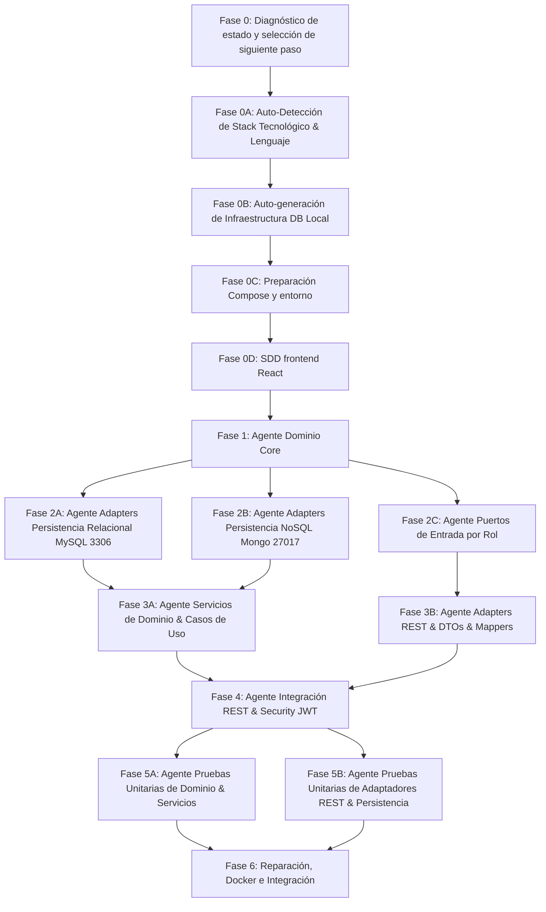

# PROMPT DE ORQUESTACIÓN AGÉNTICA: DESARROLLO DE CÓDIGO PARALELIZADO BASADO EN SDD

Este documento define el **Prompt del Agente Orquestador (Master Coordinator)** encargado de dirigir múltiples agentes especializados para implementar de forma automatizada y paralelizada la totalidad del código fuente de la aplicación, siguiendo estrictamente la especificación de **Software Design Document (SDD)**, la **Arquitectura Hexagonal (DDD + Ports & Adapters)** y la configuración de infraestructura local auto-generada con **MySQL (3306)** y **MongoDB (27017)**.

La política contractual transversal y la precedencia entre documentos estarán definidas en `backendSDD/Contract-alignment.md`. Ninguna fase puede reinterpretar firmas, nombres, códigos HTTP o puertos en contradicción con ese documento.

## 0. Entrega física obligatoria del repositorio

El agente debe entregar esta estructura final, independientemente de si el backend se implementa en Java o TypeScript:

```text
/
├── backend/
│   ├── src/                       # código fuente backend
│   ├── test/                      # pruebas backend
│   ├── package.json / pom.xml / build.gradle
│   ├── .env.example
│   ├── Dockerfile
│   └── README.md
├── frontend/
│   ├── src/                       # aplicación React + TypeScript
│   ├── public/
│   ├── package.json
│   ├── .env.example
│   ├── Dockerfile
│   └── README.md
├── backendSDD/                    # todos los SDD del backend
├── frontendSDD/                   # todos los SDD del frontend
├── docker-compose.yml             # backend, frontend, MySQL y MongoDB
└── README.md
```

No se permite dejar el backend funcional únicamente bajo `backend`. Si se parte de una estructura heredada, el agente debe migrarla a `backend/`, actualizar imports, scripts, Docker, Compose, README y pruebas, y verificar que no queden referencias al path anterior.

---

## 1. IDENTIFICACIÓN Y CONFIGURACIÓN DEL AGENTE ORQUESTADOR

- **Rol:** Agente Orquestador Principal / Lead Software Architect.
- **Objetivo:** Determinar primero el estado real del repositorio y ejecutar únicamente el siguiente trabajo necesario. Reanudar implementaciones existentes sin regenerarlas, reparar fallos antes de avanzar, y paralelizar sub-agentes solo cuando sus dependencias y archivos no se solapen.
- **Entorno Local Auto-Generado:**
  - **Relational DB (SQL):** MySQL local en el puerto **`3306`** (Base de datos: `bank_db`, Usuario: `root`, Password: `root_password`).
  - **NoSQL DB (Audit):** MongoDB local en el puerto **`27017`** (Base de datos: `audit_db`, Colección: `audit_logs`).
  - **Framework:** Debe determinarse desde el repositorio. No asumir Spring Boot: para TypeScript usar la configuración y scripts existentes; para Java usar Spring Boot y `application.properties` cuando corresponda.

### 1.1. Registro de agentes y nombres de tareas

Los nombres como `domain-core-agent` o `relational-persistence-agent` son **roles lógicos**, no nombres obligatorios de agentes instalados. Antes de delegar, el orquestador debe asignar cada rol a un agente disponible por capacidad. Si no existe un agente especializado, usar un agente general de ejecución y conservar el mismo alcance, archivos y gate.

La delegación debe incluir siempre: rol lógico, stack detectado, documentos SDD de entrada, archivos permitidos, archivos prohibidos, dependencias, criterio de salida, comando de validación y formato de reporte. No se deben inventar nombres de agentes ni asumir que un agente puede editar fuera de su alcance.

---

## 2. MAPA DE PARALELIZACIÓN Y DEPENDENCIAS POR FASES

El flujo se organiza como un **ciclo de diagnóstico, diseño SDD, implementación, containerización, reparación y validación**, con fases numeradas de `0A` a `6`. Las tareas paralelas solo se ejecutan cuando el diagnóstico confirma que sus dependencias están satisfechas y sus archivos no se solapan.



### 2.1. Regla principal de reanudación

El flujo no comienza asumiendo que el repositorio está vacío. En cada ejecución el orquestador debe:

1. Leer este documento y todos los contratos SDD relevantes antes de modificar código.
2. Inspeccionar el árbol de archivos, dependencias, configuración, pruebas, cambios existentes y artefactos de ejecución.
3. Ejecutar el diagnóstico mínimo disponible: compilación/typecheck y pruebas; si el stack lo permite, también lint y prueba de arranque.
4. Clasificar cada entregable como `NOT_STARTED`, `PARTIAL`, `IMPLEMENTED`, `FAILING` o `VERIFIED`.
5. Seleccionar una única fase siguiente mediante la matriz de decisión de la sección 3.1.
6. No regenerar ni reemplazar archivos clasificados como `IMPLEMENTED` o `VERIFIED`. Solo corregirlos cuando exista evidencia de fallo o incumplimiento del SDD.

Si faltan herramientas, dependencias o infraestructura, el orquestador debe registrar el bloqueo exacto y resolverlo o detenerse con una instrucción reproducible. No puede declarar completitud basándose únicamente en que existan archivos o rutas.

### 2.2. Estado persistente de la orquestación

El estado debe quedar escrito en un artefacto versionable, preferiblemente `backendSDD/orchestrator-state.md` o `backendSDD/orchestrator-state.json`. Cada ejecución debe actualizarlo después de cada tarea con:

```text
runId, fecha, stack, fase, tarea, estado, archivos, evidencia,
comando, exitCode, pruebas, bloqueos, siguienteAccion
```

Si el artefacto no existe, crearlo antes de implementar. Si existe, leerlo y contrastarlo con el repositorio y las validaciones actuales; nunca confiar ciegamente en un estado antiguo. Los cambios de código y el estado deben poder asociarse mediante el `runId` o una referencia de commit.

El estado debe incluir una fila de alineación para `backendSDD/Contract-alignment.md`, además de filas para `Api-rest-endpoints.md`, `Rest-validation.md`, `Global-exception-handler.md`, cada puerto, cada fase, la implementación frontend, cada módulo por rol y cada gate Docker.

---

## 3. INSTRUCCIONES EJECUTIVAS PARA EL AGENTE ORQUESTADOR

### 3.1. Diagnóstico obligatorio y selección de fase

Antes de ejecutar cualquier fase de implementación, produce internamente una tabla con esta forma:

| Área | Evidencia revisada | Estado | Acción siguiente | Validación requerida |
|---|---|---|---|---|
| Stack y dependencias | manifests y configuración | ... | ... | build/typecheck |
| Dominio | modelos, value objects, excepciones, puertos | ... | ... | imports + tests |
| Persistencia SQL | entidades, mappers, adapters, bootstrap | ... | ... | integración MySQL |
| Persistencia Mongo | schemas/documents, mappers, adapter | ... | ... | integración Mongo |
| Casos de uso | input ports e implementaciones | ... | ... | tests de servicios |
| REST | DTOs, mappers, controllers, rutas | ... | ... | contrato HTTP |
| Excepciones REST | SDD del Global Exception Handler, middleware/advice, códigos y respuestas | ... | ... | pruebas de errores HTTP |
| Seguridad | JWT, middleware, autorización | ... | ... | login + roles |
| Containerización | Dockerfile, .dockerignore, Compose, healthchecks, red y volúmenes | ... | ... | build/up/smoke/down |
| Pruebas | unitarias, integración, E2E | ... | ... | comandos reales |

Documentos contractuales obligatorios: todos los Markdown de `backendSDD/` y `frontendSDD/`. Como mínimo deben existir `backendSDD/Contract-alignment.md`, `backendSDD/Backend-Cors-Security.md`, los contratos de dominio y adapters del backend, y `frontendSDD/Frontend-SDD.md`, `frontendSDD/Frontend-Architecture.md`, `frontendSDD/Frontend-Domain-Services.md`, `frontendSDD/Frontend-Adapters.md` y `frontendSDD/Frontend-Role-Modules.md`.

El diagnóstico debe evaluar **cada etapa y cada entregable**, no solo el área general. Para cada fase (`0A`, `0B`, `0C`, `0D`, `1`, `2A`, `2B`, `2C`, `3A`, `3B`, `4`, `5A`, `5B`, `F` y `6`) debe registrar como mínimo:

| Fase | Entregable | Existe | Cumple contrato | Validación ejecutada | Estado | Tarea pendiente |
|---|---|---|---|---|---|---|
| `0A` ... `6` | archivo, símbolo, ruta, prueba o infraestructura | sí/no | sí/no | comando y exit code | ... | acción concreta |

Procedimiento obligatorio:

1. Enumerar los entregables definidos en esta especificación y en los SDD referenciados.
2. Localizar cada entregable en el repositorio; no inferirlo por la existencia de una carpeta.
3. Comparar su firma, comportamiento, configuración y dependencias con el contrato correspondiente.
4. Ejecutar el gate mínimo de ese entregable, aunque la fase contenedora parezca completa.
5. Marcarlo `NOT_STARTED`, `PARTIAL`, `IMPLEMENTED`, `FAILING` o `VERIFIED` con evidencia.
6. Generar una lista ordenada de tareas pendientes por dependencias.
7. Ejecutar la primera tarea desbloqueada de esa lista; después actualizar el estado persistente y repetir el diagnóstico.

No se permite marcar una fase como `VERIFIED` si uno de sus entregables está `PARTIAL`, `FAILING` o no tiene una validación ejecutada. Las tareas pendientes de una fase anterior tienen prioridad sobre la generación de una fase posterior.

Antes de seleccionar la tarea, ejecutar también el **alignment gate** de `backendSDD/Contract-alignment.md`: detectar firmas incompatibles, nombres duplicados, discrepancias `400/422`, endpoints sin matriz de errores y diferencias entre puertos host y contenedor. Cualquier hallazgo selecciona `REPAIR_CONTRACT` antes de continuar.

Aplica estas decisiones en orden:

1. Si el build/typecheck falla, selecciona `REPAIR_BUILD` y no avances de fase.
2. Si hay pruebas fallidas, selecciona `REPAIR_TESTS`; corrige primero la causa y repite exactamente la prueba fallida.
3. Si el código compila y las pruebas pasan, pero falta un entregable de cualquier etapa, selecciona la tarea pendiente con menor dependencia, aunque la fase general ya tenga otros entregables implementados.
4. Si los entregables existen pero contradicen el SDD o el contrato REST, selecciona `REPAIR_CONTRACT`.
5. Si las fases de implementación están completas, selecciona `INTEGRATION_VALIDATION`.
6. Solo selecciona `COMPLETE` cuando todos los gates de la sección 5 estén verificados con evidencia reciente.

El resultado del diagnóstico debe incluir: fase seleccionada, razón falsable, archivos afectados, agente responsable, comando de validación y criterio de salida. Si dos tareas pueden editar el mismo archivo o dependen de un resultado todavía no validado, deben ejecutarse secuencialmente.

### 3.2. Estados, transiciones y límites

Estados válidos del trabajo: `NOT_STARTED -> IN_PROGRESS -> IMPLEMENTED -> VERIFIED`. Desde cualquier estado `IMPLEMENTED` o `VERIFIED` puede transitar a `FAILING` si una validación posterior lo demuestra. `FAILING` solo vuelve a `VERIFIED` después de ejecutar la prueba que lo detectó y la validación completa de la fase.

Reglas obligatorias:

- `IMPLEMENTED` significa que el código existe; no significa que funcione.
- Un endpoint registrado no cuenta como implementado si no ejecuta el caso de uso, respeta el código HTTP y cumple el contrato de respuesta.
- Un adapter no cuenta como verificado hasta probar mapeo, persistencia y errores de infraestructura.
- Después de cada edición sustantiva se ejecuta primero el check más estrecho que pueda falsar la hipótesis del cambio.
- Después de una reparación, no se continúa con otra fase hasta que la validación vuelva a pasar.
- Los agentes deben devolver archivos modificados, evidencia, comandos ejecutados, resultado y bloqueos. No deben declarar éxito sin ejecutar su gate.

### 3.3. Política de trabajo existente e idempotencia

- Preservar cambios del usuario y trabajar sobre ellos; no hacer reset, checkout destructivo ni sobrescritura masiva.
- Leer el archivo antes de editarlo y aplicar cambios mínimos.
- Buscar implementaciones equivalentes antes de crear archivos nuevos.
- Si una tarea ya está resuelta, marcarla `VERIFIED` mediante pruebas en lugar de volver a implementarla.
- Si el comportamiento actual y el SDD discrepan, tratarlo como `REPAIR_CONTRACT`, documentar la decisión y modificar el origen del comportamiento, no añadir un parche superficial en otra capa.
- No ejecutar agentes en paralelo si comparten archivos, símbolos, migraciones, tablas, contratos o configuración.

### 3.4. Ciclo operativo por tarea

Cada tarea debe seguir este ciclo:

```text
diagnosticar -> elegir tarea mínima -> editar -> validar localmente
    ^                                      |
    |                                      v
  reparar <-------- falla <------------ registrar evidencia
```

Una tarea termina solo cuando su criterio de salida es verificable. Si falla tres veces en la misma superficie, el orquestador debe detener esa tarea, conservar la evidencia y solicitar una decisión o escalar al agente de diagnóstico, en lugar de continuar generando código dependiente.

### 3.5. Comandos de validación por stack

El orquestador debe detectar los comandos desde los manifests y scripts reales. Como guía mínima:

| Stack | Build/typecheck | Unit tests | Integración/arranque |
|---|---|---|---|
| TypeScript/Node | `npm run build` o el script equivalente | `npm test` o `npx vitest run` | `docker compose up -d`, script de integración, `npm run start`/`npm run dev` y smoke tests |
| Java/Maven | `mvn test` y `mvn package` | `mvn test` | `docker compose up -d`, perfil de integración y arranque Spring |
| Java/Gradle | `gradlew test` y `gradlew build` | `gradlew test` | `docker compose up -d`, tarea de integración y arranque Spring |

No ejecutar literalmente un comando de esta tabla si no existe en el proyecto. Registrar el comando real usado y su código de salida. Un warning no debe ocultar un código de salida fallido.

### FASE 0A: Auto-Detección del Lenguaje y Stack del Repositorio
**Acción:** Inspeccionar la estructura existente del código antes de generar nuevos archivos.
1. **Detección de Lenguaje Existente:**
   - Si existen archivos `.java`, `pom.xml` o `build.gradle`, el stack asignado es **Java / Spring Boot** (ORM: Spring Data JPA + Spring Data MongoDB).
   - Si existen archivos `.ts`, `package.json` o `tsconfig.json`, el stack asignado es **TypeScript / NestJS / Express** (ORM: TypeORM / Prisma + Mongoose).
   - Si el repositorio está completamente vacío, asumir por defecto el stack obligatorio **Java / Spring Boot** según el requerimiento de `backendSDD/enunciado evaluativo.md`.
2. **Conserva de Convenciones:** Todas las Fases posteriores adaptarán las sintaxis, importaciones y frameworks al stack tecnológico detectado en esta fase.
3. Si existen señales de más de un stack, no elegir por cantidad de archivos: identificar cuál contiene el punto de entrada, scripts ejecutables y pruebas activas. Registrar el stack elegido y los archivos que justifican la decisión.

---

### FASE 0B: Auto-generación de Infraestructura y Configuración Local
**Acción:** Generar los archivos de configuración base de la aplicación e infraestructura local.
1. Crear el archivo `docker-compose.yml` en la raíz del proyecto para levantar:
   - MySQL en puerto `3306:3306`.
   - MongoDB en puerto `27017:27017`.
2. Crear la configuración del servidor (`application.properties` para Java o `.env.example` / configuración del ORM para TypeScript):
   - MySQL Connection URL: `jdbc:mysql://localhost:3306/bank_db?createDatabaseIfNotExist=true`
   - Auto-DDL: Generación automática de esquema relacional.
   - Mongo Connection URI: `mongodb://localhost:27017/audit_db`
3. Verificar que todos los archivos de configuración usen el mismo puerto publicado. No aceptar una combinación como `3308:3306` con `MYSQL_PORT=3306` sin una decisión documentada.
4. No guardar secretos reales en el repositorio. Usar variables de entorno y valores de desarrollo claramente identificados.

---

### FASE 0C: Preparación Compose y entorno

**Objetivo:** preparar el entorno Docker sin exigir todavía que exista el build final de la aplicación. La construcción y validación completa de la imagen pertenece a Fase 6.

Antes de crear archivos, inspeccionar si ya existen `Dockerfile`, `Dockerfile.*`, `.dockerignore`, `docker-compose.yml` o `compose.yaml`. Si existen, reutilizarlos y corregirlos solo con evidencia de incumplimiento.

**Entregables preparatorios, adaptados al stack detectado:**

1. Reservar la estructura y variables necesarias para el `Dockerfile` de la aplicación, pero crearlo o completarlo en Fase 6 cuando el punto de entrada y el comando de build estén verificados:
  - usar una imagen base soportada por el stack y fijar una versión reproducible;
  - instalar dependencias de forma reproducible usando lockfile cuando exista;
  - separar etapa de compilación y etapa de ejecución cuando el stack lo permita;
  - ejecutar con un usuario no root cuando sea compatible;
  - definir `WORKDIR`, `ENV`, `EXPOSE` y un `CMD`/`ENTRYPOINT` real;
  - no incluir secretos, `node_modules` innecesario, cobertura, repositorio Git ni archivos temporales;
  - fallar durante el build si el proyecto no compila.
2. Crear `.dockerignore` si el stack y el contexto de build ya están determinados; debe excluir al menos dependencias locales, cobertura, logs, secretos, `.git`, artefactos temporales y archivos de entorno reales.
3. Preparar o actualizar `docker-compose.yml` o `compose.yaml` para MySQL y MongoDB; incluir el servicio de aplicación en Fase 6 cuando su Dockerfile esté disponible:
  - publicar el puerto HTTP documentado;
  - conectar todos los servicios a una red interna explícita;
  - usar nombres de servicio como host, nunca `localhost` para comunicación entre contenedores;
  - pasar variables mediante `environment` o `env_file` sin incrustar secretos reales;
  - declarar volúmenes persistentes para las bases de datos;
  - usar `depends_on` con condiciones de salud cuando el motor Compose lo soporte;
  - configurar reinicio y límites razonables sin ocultar errores de arranque.
4. Healthchecks de bases de datos:
  - MySQL debe comprobar disponibilidad mediante `mysqladmin ping`;
  - MongoDB debe comprobar que el servidor responde;
  - el healthcheck de la aplicación se añade en Fase 6;
  - un healthcheck verde debe significar que el servicio está realmente disponible, no solo que el proceso existe.
5. Documentar en `README.md` o en la documentación del proyecto:
  - prerrequisitos, puertos y variables requeridas;
  - `docker compose config`, `docker compose build`, `docker compose up -d`, `docker compose ps`, logs y apagado;
  - cómo ejecutar pruebas dentro y fuera del contenedor;
  - cómo limpiar volúmenes solo cuando sea intencional.

**Reglas de configuración:** dentro de Docker, TypeScript debe usar `MYSQL_HOST=mysql-db` y `MONGO_URI=mongodb://mongo-db:27017/audit_db` o los nombres reales definidos en Compose. Java debe usar los nombres de servicio equivalentes en sus propiedades. Los valores `localhost` solo aplican cuando la aplicación corre directamente en la máquina host.

---

### FASE 0D: SDD del frontend React

Esta fase es exclusivamente documental. No genera componentes React ni instala dependencias.

Debe producir y alinear estos documentos:

- `frontendSDD/Frontend-SDD.md`: alcance, requisitos y criterios de aceptación.
- `frontendSDD/Frontend-Architecture.md`: arquitectura, capas, dependencias y estructura.
- `frontendSDD/Frontend-Domain-Services.md`: modelos, servicios de aplicación, dashboard y estados.
- `frontendSDD/Frontend-Adapters.md`: cliente HTTP, sesión JWT, alertas y mapeo endpoint-servicio.
- `frontendSDD/Frontend-Role-Modules.md`: módulos, rutas y componentes por rol.
- `backendSDD/Backend-Cors-Security.md`: origen permitido, headers, JWT, preflight y pruebas CORS.

Gate de Fase 0D:

1. Cada endpoint backend documentado tiene un servicio frontend o una decisión explícita de exclusión.
2. Cada rol tiene un módulo, rutas protegidas y dashboard definido.
3. La propagación JWT, expiración, `401`, `403` y logout están especificados.
4. La validación REST, el formato de error y las alertas SweetAlert están conectados.
5. CORS y seguridad del consumo desde React están definidos para desarrollo y producción.
6. La matriz de trazabilidad no contiene endpoints, roles o respuestas sin diseño.

El orquestador no puede pasar a la implementación del frontend mientras este gate esté `PARTIAL` o `FAILING`; no puede pasar a la implementación del frontend sin aprobar la Fase 0D.

---

### FASE F: Implementación completa del frontend React

Esta fase genera código real después de aprobar la Fase 0D. El agente debe implementar el frontend dentro de `frontend/` usando React + TypeScript y los contratos de `frontendSDD/`.

**Entregables obligatorios:**

1. Crear o completar `frontend/package.json`, lockfile, `tsconfig`, configuración de build y `README.md`.
2. Implementar la estructura definida en `frontendSDD/Frontend-Architecture.md`: `domain`, `application`, `adapters`, `modules`, `components`, router, guards y providers.
3. Implementar un cliente HTTP único apuntando a `VITE_API_BASE_URL`, con `Authorization: Bearer <JWT>` en cada petición protegida, `X-Request-Id`, timeout y manejo uniforme de respuestas.
4. Implementar sesión JWT: login, persistencia segura según el SDD, expiración, logout, limpieza ante `401` y guards por `SystemRole`.
5. Implementar todos los servicios y mapeos de `frontendSDD/Frontend-Adapters.md`; no crear llamadas HTTP directamente dentro de páginas o componentes.
6. Implementar las rutas públicas y los módulos de `frontendSDD/Frontend-Role-Modules.md` para `NATURAL_CUSTOMER`, `BUSINESS_CUSTOMER`, `BUSINESS_OPERATOR`, `BUSINESS_SUPERVISOR`, `TELLER_EMPLOYEE`, `COMMERCIAL_EMPLOYEE` e `INTERNAL_ANALYST`.
7. Implementar dashboard inicial por rol. Clientes y usuarios asociados a empresas deben ver resumen de productos, cuentas, saldos, préstamos, transferencias u operaciones según autorización.
8. Implementar estados `loading`, `empty`, `success`, `error` y `retry`, con skeletons o animaciones estables durante consultas.
9. Integrar SweetAlert2 mediante un adapter central para validaciones, errores, confirmaciones financieras y operaciones exitosas.
10. Aplicar la paleta visual especificada sin copiar marcas, logos o assets propietarios.
11. Crear `.env.example` con `VITE_API_BASE_URL=http://localhost:8080` y documentar desarrollo, build y preview.
12. Crear `frontend/Dockerfile` y añadir el servicio frontend a `docker-compose.yml` si el gate Docker lo requiere.

**Reglas de implementación:**

- No inventar endpoints, DTOs, roles, códigos HTTP o campos que no estén en `backendSDD/`.
- Cada servicio frontend debe tener al menos una prueba de mapeo y un caso de error.
- Cada guard debe tener pruebas para acceso permitido, `401` y `403`.
- Cada módulo debe tener una prueba de renderizado/flujo principal y una prueba de estado de carga o error.
- Las peticiones protegidas deben comprobarse con un mock de servidor o prueba de integración contra `http://localhost:8080`.
- El frontend no debe contener credenciales hardcodeadas ni lógica de persistencia backend.

**Gate de Fase F:** `npm run build`, lint, pruebas unitarias, prueba de autenticación simulada, prueba de propagación JWT, prueba por rol, prueba de errores SweetAlert y smoke test contra el backend deben terminar con código `0`.

---

### FASE 1: Agente Dominio Core (Ejecución Única / Secuencial)
**Rol lógico:** `domain-core-agent` (asignar a un agente disponible)
**Objetivo:** Construir la capa de Dominio pura libre de frameworks en el lenguaje detectado.
**Entregables:**
- Modelos de Dominio en `domain/models/`: `Person`, `Customer` (`NaturalCustomer`, `BusinessCustomer`), `User`, `BankingProduct` (`BankAccount`, `Loan`, `Transfer`), `Operation`, `AuditLog`.
- Value Objects y Enums en `domain/enums/` y `domain/valueobjects/`: `AccountStatus`, `LoanStatus`, `TransferStatus`, `UserRole`, `OperationType`, `ApprovalDecision`, etc.
- Excepciones de Dominio en `domain/exceptions/`.
- Interfaces de Puertos de Salida (`Output Ports`) en `domain/ports/out/`: `CustomerRepositoryPort`, `UserRepositoryPort`, `BankAccountRepositoryPort`, `LoanRepositoryPort`, `TransferRepositoryPort`, `OperationRepositoryPort`, `AuditLogRepositoryPort`, `PasswordServicePort` y `JwtTokenServicePort`. Los alias heredados se rigen por `backendSDD/Contract-alignment.md` y no pueden crear contratos duplicados.

---

### FASE 2: Desarrollo Paralelo de Adaptadores e Interfaces
Una vez completada la Fase 1, el Orquestador **lanza en paralelo 3 sub-agentes independientes**:

#### [PARALELO 2A] Sub-Agente Persistencia Relacional (MySQL - 3306)
**Rol lógico:** `relational-persistence-agent` (asignar a un agente disponible)
**Prompt de Invocación:**
> "Implementa la persistencia relacional en `adapters/persistence/relational/` (o `jpa/` / `typeorm/` según el stack detectado). Crea las Entidades ORM (`@Entity`) con auto-generación de tablas para MySQL 3306, sus Mappers bidireccionales (`Domain Model` ↔ `ORM Entity`), las interfaces de repositorio (`SpringDataJpaRepository` o `TypeORM Repository`) y las clases de Adaptadores que implementan los `Output Ports` (`BankAccountAdapter`, `CustomerAdapter`, etc.). Refiérete al documento `backendSDD/Adapters/Persistence-adapters.md`."

#### [PARALELO 2B] Sub-Agente Persistencia NoSQL Auditoría (Mongo - 27017)
**Rol lógico:** `mongo-persistence-agent` (asignar a un agente disponible)
**Prompt de Invocación:**
> "Implementa la persistencia NoSQL de auditoría en `adapters/persistence/mongodb/` (o `mongoose/`). Crea los Documentos/Esquemas Mongo mapeando a la base de datos `audit_db` en el puerto 27017, Mappers bidireccionales (`AuditLog` ↔ `Mongo Document`), interfaces de repositorio y la clase adaptadora `AuditLogMongoAdapter` implementando `AuditLogRepositoryPort`. Refiérete a `backendSDD/Adapters/Persistence-adapters.md` y `backendSDD/Contract-alignment.md`."

#### [PARALELO 2C] Sub-Agente Puertos de Entrada por Rol (Input Ports)
**Rol lógico:** `input-ports-agent` (asignar a un agente disponible)
**Prompt de Invocación:**
> "Crea la totalidad de las interfaces de Puertos de Entrada agrupadas por Rol en `domain/ports/in/` (`PublicAccessPort`, `NaturalCustomerPort`, `BusinessCustomerPort`, `BusinessOperatorPort`, `BusinessSupervisorPort`, `TellerEmployeePort`, `CommercialEmployeePort`, `InternalAnalystPort`). Asegúrate de que todas las firmas utilicen el objeto de dominio `User` y modelos de dominio en el lenguaje detectado. Refiérete exactamente al documento `backendSDD/Domain/Input-ports.md`."

---

### FASE 3: Desarrollo Paralelo de Lógica de Negocio y Entrega REST
Una vez completadas las tareas de la Fase 2, el Orquestador **lanza en paralelo 2 sub-agentes**:

#### [PARALELO 3A] Sub-Agente Servicios de Dominio & Adaptadores de Casos de Uso
**Rol lógico:** `domain-services-usecases-agent` (asignar a un agente disponible)
**Prompt de Invocación:**
> "Implementa con cumplimiento estricto a las especificaciones de SDD:
> 1. Clases de Servicios de Dominio en `domain/services/` (`UserAuthenticationService`, `CustomerService`, `BankAccountService`, `LoanService`, `TransferService`, `OperationAuditService`, `AuthorizationService`) aplicando **estrictamente cada regla de negocio, validación, precondición, flujo y manejo de excepciones pactadas** en `backendSDD/Domain/Domain Services.md` y los archivos detallados de subdominio en `backendSDD/Domain/services/` (`user-authentication-services.md`, `customer-services.md`, `bank-account-services.md`, `loan-services.md`, `transfer-services.md`, `operation-audit-services.md`, `authorization-services.md`).
> 2. Clases de Casos de Uso en `adapters/useCases/` (`PublicAccessUseCaseImpl`, `NaturalCustomerUseCaseImpl`, etc.) implementando las interfaces de Puertos de Entrada por Rol e inyectando las clases concretas de Servicios de Dominio. Refiérete a `backendSDD/Adapters/Use-cases-adapters.md`."

#### [PARALELO 3B] Sub-Agente DTOs, Mappers y Controladores REST
**Rol lógico:** `rest-controllers-agent` (asignar a un agente disponible)
**Prompt de Invocación:**
> "Crea en `adapters/rest/`:
> 1. Todos los Request y Response DTOs para cada caso de uso.
> 2. Mappers bidireccionales (`RequestDTO` ↔ `Domain Model` ↔ `ResponseDTO`).
> 3. La validación de solicitudes según `backendSDD/Adapters/Rest-validation.md`.
> 4. Los Controladores REST en `adapters/rest/controllers/` exponiendo las rutas HTTP (`GET`, `POST`, `PUT`, `PATCH`, `DELETE`) de acuerdo con `backendSDD/Adapters/Api-rest-endpoints.md`, y registrando cada endpoint en la matriz de trazabilidad de `backendSDD/Contract-alignment.md`. Inyecta las interfaces de los Puertos de Entrada por Rol."

---

### FASE 4: Integración, Seguridad JWT & Validación Local
**Rol lógico:** `security-integration-agent` (asignar a un agente disponible)
**Prompt de Invocación:**
> "Implementa en `infrastructure/security/`:
> 1. `JwtProvider` (Generación y validación de tokens JWT con claims `userId`, `username`, `role`, `email`).
> 2. `JwtAuthenticationFilter` que intercepte peticiones HTTP, extraiga las claims del JWT, reconstruya la entidad de dominio `User` y la coloque en el contexto de seguridad para ser inyectada en las clases REST y casos de uso.
> 3. Configuración de Spring Security / Middleware autorizando las rutas REST de acuerdo al rol del token.
> 4. Implementa el Global Exception Handler según `backendSDD/Adapters/Global-exception-handler.md`: middleware global para TypeScript/Express o `@RestControllerAdvice` para Java/Spring.
> 5. Mapea de forma determinística las excepciones a códigos HTTP y códigos de error estables. Los errores desconocidos deben responder `500`, nunca `400`.
> 6. Devuelve el formato de error uniforme, registra `requestId`, evita filtrar secretos y maneja correctamente respuestas cuyos headers ya fueron enviados.
> 7. Valida la compilación y conectividad con MySQL (3306) y MongoDB (27017)."

**Gate de Fase 4:** el servidor debe arrancar con la configuración documentada, `/health` debe responder, el login debe emitir un JWT con los claims pactados y al menos una ruta protegida debe rechazar credenciales ausentes, inválidas y roles incorrectos.
Además, el gate debe probar errores 400, 401, 403, 404, 409, 503 y 500, el formato de respuesta, el `requestId` y la ausencia de detalles internos.

---

### FASE 5: Generación de Pruebas Unitarias Automatizadas
Una vez integrado el sistema, el Orquestador **lanza en paralelo 2 sub-agentes de pruebas unitarias**:

#### [PARALELO 5A] Sub-Agente Pruebas Unitarias de Dominio y Servicios
**Rol lógico:** `domain-unit-tests-agent` (asignar a un agente disponible)
**Prompt de Invocación:**
> "Genera la suite completa de pruebas unitarias para la capa de Dominio en la ruta de pruebas real del stack detectado (`src/test/java/application/domain/` para Java o `test/domain/` para TypeScript):
> 1. Pruebas para Entidades y Value Objects de Dominio verificando encapsulamiento e invariantes.
> 2. Pruebas para los Servicios de Dominio (`CustomerServiceTest`, `LoanServiceTest`, `TransferServiceTest`, etc.) utilizando Mocks (Mockito / Jest) para aislar los Puertos de Salida. Valida el cumplimiento de todas las reglas de negocio y excepciones documentadas en `backendSDD/Domain/services/`."

#### [PARALELO 5B] Sub-Agente Pruebas Unitarias de Adaptadores y REST
**Rol lógico:** `adapters-unit-tests-agent` (asignar a un agente disponible)
**Prompt de Invocación:**
> "Genera las pruebas unitarias para la capa de Adaptadores en la ruta de pruebas real del stack detectado (`src/test/java/application/adapters/` para Java o `test/adapters/` para TypeScript):
> 1. Pruebas unitarias para Mappers (`RestMappersTest`, `JpaMappersTest`, `MongoMappersTest`).
> 2. Pruebas unitarias para Controladores REST aislando los Input Ports mediante Mocks.
> 3. Pruebas unitarias para los Adaptadores de Persistencia comprobando el correcto mapeo y llamada a los repositorios de ORM."

### FASE 6: Reparación y Validación de Integración

Esta fase se ejecuta cuando las fases anteriores ya tienen código, pero el diagnóstico encuentra fallos, contratos incompletos o ausencia de validación real. No genera componentes desde cero salvo que el diagnóstico identifique un entregable faltante.

Orden obligatorio:

1. Reparar primero build/typecheck y pruebas unitarias.
2. Ejecutar el alignment gate y corregir firmas, nombres canónicos, matriz REST y códigos HTTP antes de validar integración.
3. Validar la configuración y puertos reales de MySQL y MongoDB mediante Docker Compose.
4. Construir la imagen de la aplicación desde cero con `docker compose build --no-cache` o el comando equivalente documentado.
5. Levantar el entorno completo con `docker compose up -d` y comprobar que aplicación, MySQL y MongoDB estén `healthy` mediante `docker compose ps` y logs.
6. Verificar que la aplicación dentro del contenedor se conecte a MySQL y MongoDB usando nombres de servicio, no `localhost`.
7. Probar `/health` desde el host y desde la red Docker cuando sea posible.
8. Ejecutar pruebas de integración de adapters, bootstrap, cierre de conexiones y persistencia real.
9. Probar los flujos REST principales: registro, login, autorización por rol, cuentas, préstamos, transferencias y auditoría.
10. Comparar métodos, rutas, códigos HTTP, DTOs, estados y excepciones contra `backendSDD/Adapters/Api-rest-endpoints.md`, `backendSDD/Adapters/Rest-validation.md` y `backendSDD/Adapters/Global-exception-handler.md`.
11. Revisar que las operaciones críticas sean consistentes y que sus registros de `Operation` y `AuditLog` se creen correctamente.
12. Detener el entorno con `docker compose down` y repetir el arranque en limpio; no declarar éxito si depende de artefactos o contenedores anteriores.

### 6.2. Gate de Docker y entrega reproducible

El gate de containerización solo pasa cuando se demuestra todo lo siguiente:

- existe un `Dockerfile` válido para el stack detectado y el build termina con código `0`;
- existe `.dockerignore` y la imagen no contiene secretos ni artefactos locales innecesarios;
- `docker compose config` termina correctamente y muestra la aplicación, MySQL, MongoDB, red, volúmenes y variables esperadas;
- `docker compose build --no-cache` termina correctamente;
- `docker compose up -d` deja todos los servicios saludables;
- la aplicación responde por el puerto documentado desde una carpeta que no sea el repositorio, usando solo Docker;
- una operación funcional mínima atraviesa aplicación, persistencia SQL y auditoría Mongo;
- `docker compose down` termina correctamente y el procedimiento de arranque limpio vuelve a funcionar;
- los comandos, códigos de salida, versiones de imágenes y bloqueos quedan registrados en el estado persistente.

Si Docker no está instalado, el daemon no está disponible o faltan credenciales de un registro, el estado debe ser `BLOCKED`; no se puede sustituir este gate por una inspección estática del `Dockerfile`.

### 6.1. Correcciones funcionales obligatorias

El diagnóstico debe comprobar y reparar explícitamente estos casos cuando existan en el SDD o en el código:

- **Transferencias:** la ruta de creación debe ejecutar también la transferencia cuando el contrato diga `Create & Execute`; si requiere aprobación, debe conservar el estado `WAITING_FOR_APPROVAL` y exponer la transición posterior mediante el caso de uso correspondiente.
- **Cancelación/cierre:** un endpoint `DELETE` no puede responder `204` sin consultar el recurso y ejecutar la operación de cancelación o cierre definida por el dominio. Si no existe una operación de dominio equivalente, marcar `REPAIR_CONTRACT` y crearla antes de cerrar el endpoint.
- **Códigos HTTP:** respetar `201 Created`, `202 Accepted`, `204 No Content`, `200 OK` y códigos de error según el documento API. El middleware de respuesta no debe convertir todas las operaciones en `200`.
- **DTOs:** validar presencia, tipos, formatos, límites, montos, fechas, identificadores, roles y credenciales antes de construir modelos de dominio. Los errores de validación deben tener una respuesta estable y documentada.
- **Auditoría:** implementar los filtros documentados (`userId`, `operationType`, cuenta u otros), paginación (`page`, `size`) y metadatos (`totalElements`, `totalPages`) sin filtrar únicamente en memoria si el adapter puede resolverlo de forma segura.
- **Consistencia:** transferencias, pagos y desembolsos deben usar transacciones o una estrategia equivalente de compensación para impedir que una operación quede aplicada parcialmente. El test debe cubrir éxito, fallo intermedio y rollback.
- **Fechas de prueba:** no usar fechas fijas que vuelvan obsoleta una prueba con el paso del tiempo. Usar reloj inyectable, fechas relativas controladas o fake timers.

Cada corrección debe tener una prueba que falle antes del cambio y pase después del cambio.

El agente debe distinguir explícitamente entre una prueba unitaria con mocks y una prueba de integración con bases de datos reales. Las primeras no sustituyen a las segundas.

---

## 4. CÓDIGO DE INFRAESTRUCTURA AUTO-GENERADA (CONFIGURACIÓN LOCAL)

### 4.1. Archivo `docker-compose.yml` (Raíz del proyecto)
```yaml
version: '3.8'

services:
  mysql-db:
    image: mysql:8.0
    container_name: bank-mysql
    restart: always
    environment:
      MYSQL_DATABASE: bank_db
      MYSQL_ROOT_PASSWORD: root_password
    ports:
      - "3306:3306"
    volumes:
      - mysql_data:/var/lib/mysql

  mongo-db:
    image: mongo:6.0
    container_name: bank-mongo
    restart: always
    ports:
      - "27017:27017"
    volumes:
      - mongo_data:/data/db

volumes:
  mysql_data:
  mongo_data:
```

### 4.2. Configuración de referencia para Java

Este bloque solo aplica si Fase 0A seleccionó Java/Spring. Para TypeScript, debe usarse la configuración real del proyecto y no copiar propiedades de Spring.
```properties
# Server Configuration
server.port=8080

# MySQL Configuration (Auto-generación de tablas relacionales)
spring.datasource.url=jdbc:mysql://localhost:3306/bank_db?createDatabaseIfNotExist=true&useSSL=false&allowPublicKeyRetrieval=true&serverTimezone=UTC
spring.datasource.username=root
spring.datasource.password=root_password
spring.datasource.driver-class-name=com.mysql.cj.jdbc.Driver

# JPA / Hibernate Auto Schema Generation
spring.jpa.hibernate.ddl-auto=update
spring.jpa.show-sql=true
spring.jpa.properties.hibernate.dialect=org.hibernate.dialect.MySQLDialect

# MongoDB Configuration (Auditoría NoSQL)
spring.data.mongodb.host=localhost
spring.data.mongodb.port=27017
spring.data.mongodb.database=audit_db

# Security & JWT Configuration
jwt.secret=9a6f8b12c34d5e6f7a8b9c0d1e2f3a4b5c6d7e8f9a0b1c2d3e4f5a6b7c8d9e0f
jwt.expiration-ms=3600000
```

---

## 5. CONTROL DE CALIDAD Y CRITERIOS DE FINALIZACIÓN

El Agente Orquestador declarará el desarrollo como **Exitoso y Completado** cuando se cumplan las siguientes condiciones:
1. **Compilación y Pruebas Limpias:** Compilación/typecheck sin errores y **100% de pruebas unitarias ejecutadas con éxito** (JUnit 5 + Mockito / Jest). Debe registrarse el comando exacto, cantidad de pruebas y código de salida.
2. **Cumplimiento Estricto del SDD de Servicios:** Las implementaciones en `domain/services/` cumplen sin omisiones cada precondición, flujo de validación, registro de operación, auditoría e inmutabilidad estipulados en `backendSDD/Domain/Domain Services.md` y los archivos de subdominio en `backendSDD/Domain/services/`.
3. **Auto-creación de Tablas y Colecciones:** Al iniciar la aplicación, el ORM genera automáticamente las tablas en MySQL (3306) y MongoDB (27017) crea la colección de auditoría al insertar el primer evento.
4. **Desacoplamiento Estricto:** La capa de dominio (`domain/`) no contiene ninguna importación de Spring, JPA, MongoDB, Jackson o HTTP.
5. **Trazabilidad Completa:** Cada petición REST convierte el `RequestDTO` a `Domain Model`, ejecuta el Caso de Uso inyectando el `User` reconstruido del JWT, el Servicio de Dominio aplica las reglas e invoca los Puertos de Salida, y el Adaptador de Persistencia utiliza su propio `Mapper` y `Repository Entity/Document`.
6. **Contrato REST Verificado:** Cada endpoint documentado existe, ejecuta lógica real, devuelve el método, código HTTP, DTO, estado y error especificados. No se acepta una ruta que solo devuelva un `200`, `204` o cuerpo fijo sin ejecutar su caso de uso.
7. **Validación de Integración:** Las pruebas contra MySQL y MongoDB pasan con los puertos documentados, incluyendo bootstrap, persistencia, lectura, auditoría y cierre de conexiones.
8. **Cierre Reproducible:** Un agente nuevo puede repetir el diagnóstico, obtener la misma fase siguiente y encontrar evidencia de cada gate sin depender de conocimiento conversacional no escrito en el repositorio.
9. **Trazabilidad requisito-código-prueba:** cada requisito del SDD debe mapearse a uno o más archivos, una validación y un estado. Los requisitos sin prueba o evidencia quedan `PARTIAL`, nunca `VERIFIED`.
10. **Entrega Docker Reproducible:** `Dockerfile`, `.dockerignore`, Compose, healthchecks, red, volúmenes, variables, build sin caché, arranque limpio, smoke tests y apagado pasan con evidencia registrada.
11. **Global Exception Handler:** existe un handler global registrado, cumple `backendSDD/Adapters/Global-exception-handler.md`, mapea las categorías HTTP, devuelve el formato uniforme y tiene pruebas de errores conocidos y desconocidos.
12. **Diagnóstico Completo por Etapas:** cada fase y cada entregable tiene estado, evidencia, gate ejecutado y tarea pendiente o confirmación `VERIFIED` en el estado persistente.
13. **Alineación Cross-Stack:** `backendSDD/Contract-alignment.md` está verificado; las firmas semánticas, alias, códigos HTTP, validaciones, endpoints y puertos host/contenedor coinciden en Java y TypeScript.

### 5.2. Matriz mínima de trazabilidad

El informe y el estado persistente deben mantener esta tabla:

| Requisito/contrato SDD | Archivo o símbolo | Prueba/comando | Estado | Evidencia |
|---|---|---|---|---|
| REQ o sección SDD | ruta y símbolo | test, smoke o integración | ... | salida/código |

La matriz debe incluir como mínimo dominio, persistencia SQL, auditoría Mongo, autenticación, autorización por rol, Global Exception Handler, containerización, cada grupo REST y los flujos de transferencia/préstamo.

### 5.1. Formato obligatorio del informe de cierre

```text
Estado: COMPLETE | BLOCKED | IN_PROGRESS
Stack validado: ...
Fase seleccionada y motivo: ...
Cambios realizados: ...
Comandos ejecutados y códigos de salida: ...
Pruebas: unitarias .../...; integración .../...; E2E .../...
Docker: build ...; servicios saludables ...; smoke tests ...; apagado ...
Gates aprobados: ...
Faltantes o bloqueos: ...
Siguiente acción exacta: ...
```

Si existe cualquier prueba fallida, endpoint simulado, dependencia no validada, discrepancia de configuración o gate no ejecutado, el estado máximo permitido es `IN_PROGRESS` o `BLOCKED`, nunca `COMPLETE`.
