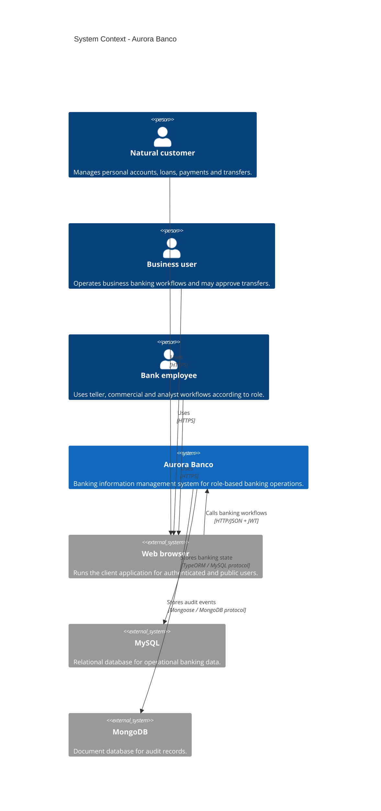
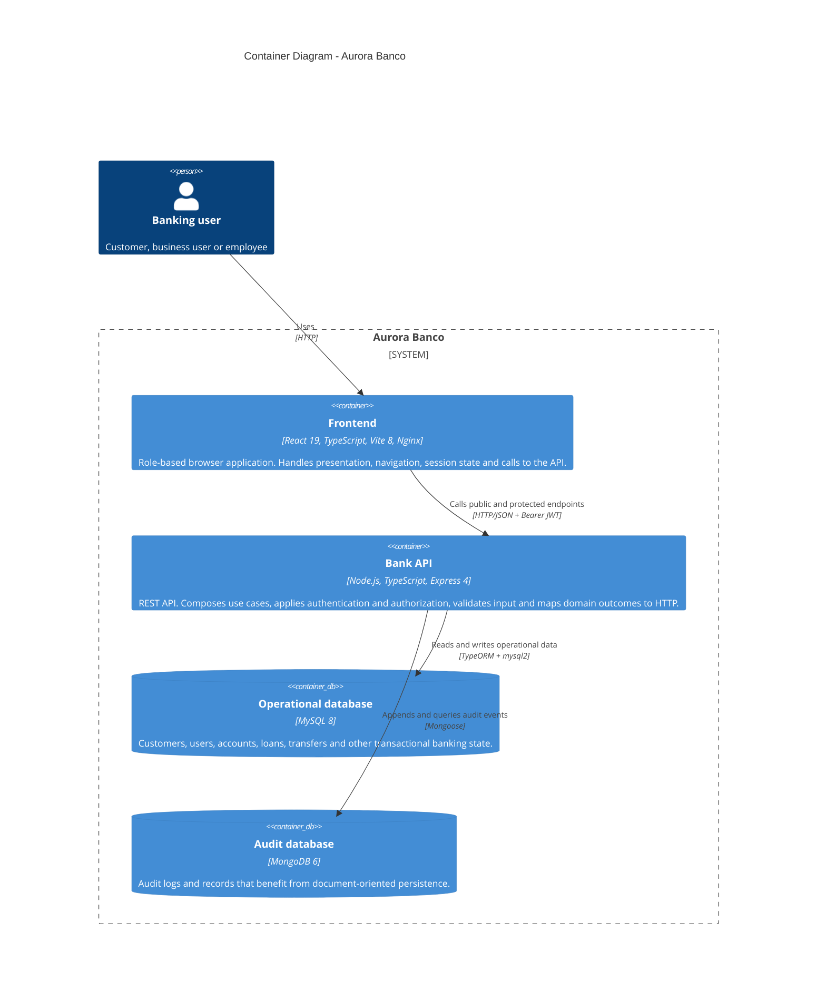
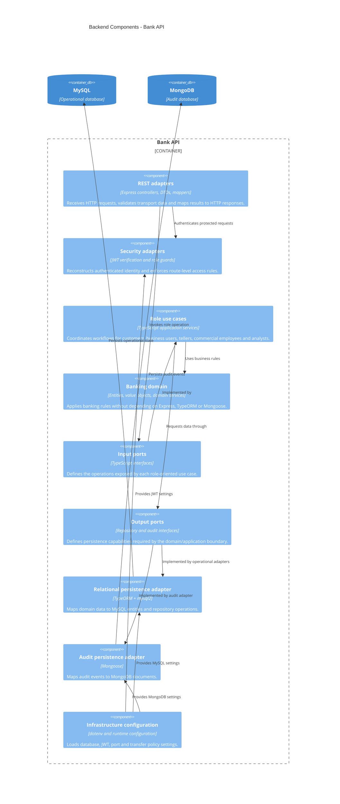
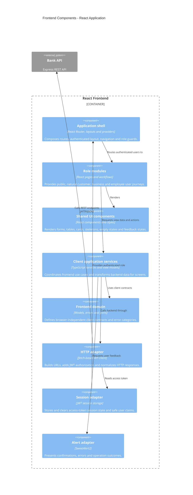
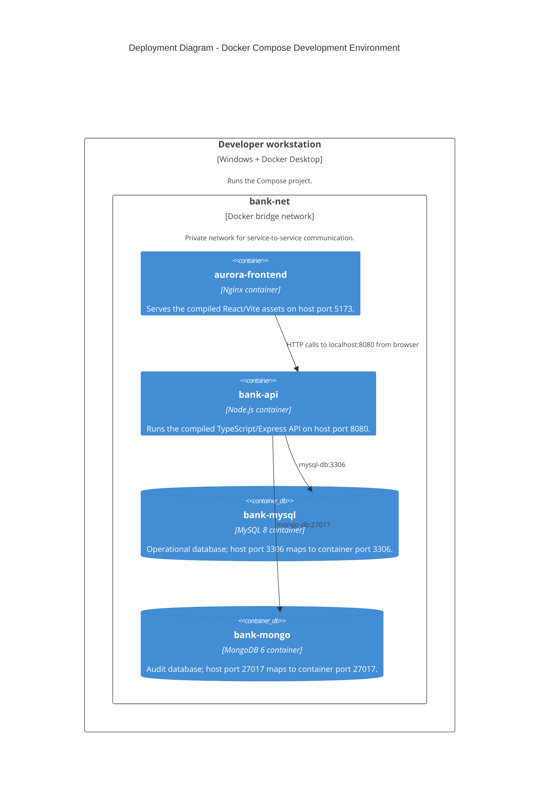
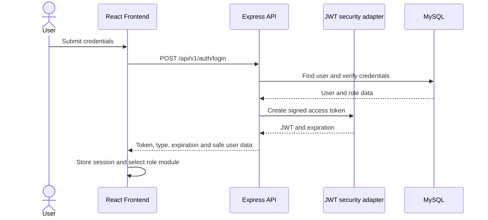
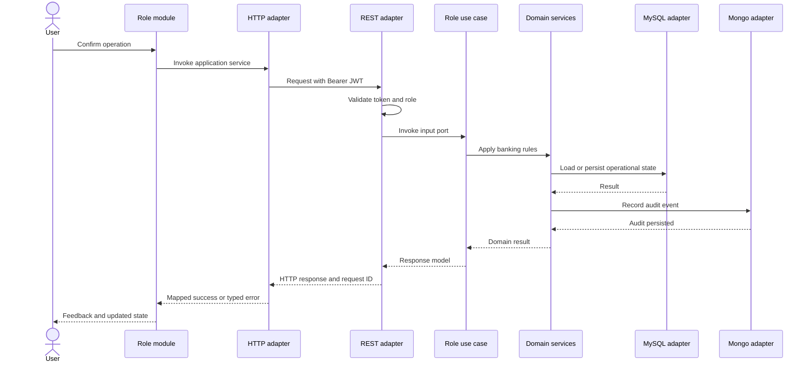
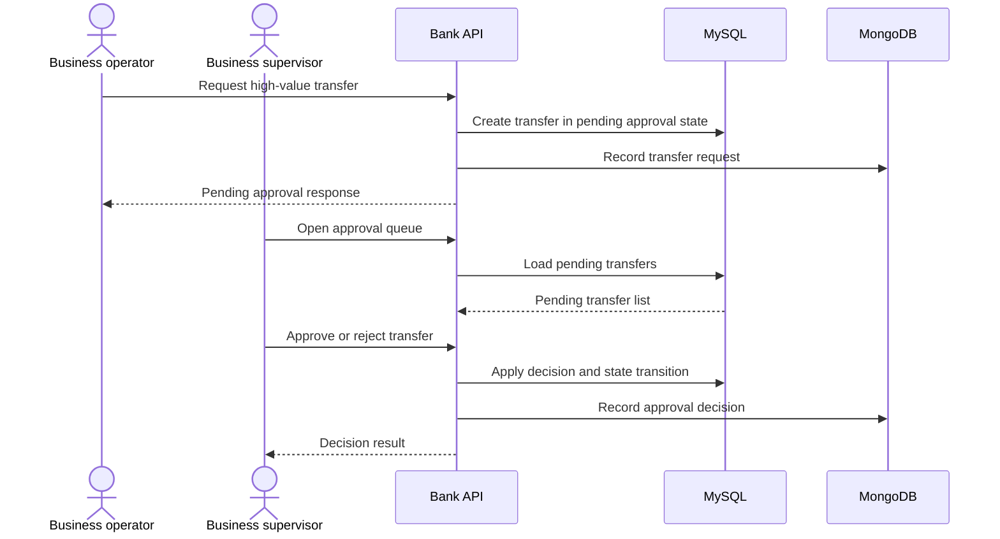

# C4 Architecture: Aurora Banco

## 1. Purpose and scope

This document describes Aurora Banco using the [C4 model](https://c4model.com/). It is the architectural companion to the backend and frontend software design documents.

The diagrams focus on the banking information system currently implemented in this repository:

- Public authentication and registration.
- Customer, business and employee role workflows.
- Accounts, balances, loans, payments, transfers and approvals.
- JWT-based authentication and role authorization.
- Relational operational data in MySQL.
- Audit data in MongoDB.
- A Docker Compose deployment for local development and validation.

The C4 levels used here are:

1. **System Context:** people and external systems around Aurora Banco.
2. **Container:** deployable applications and data stores.
3. **Component:** major responsibilities inside the frontend and backend applications.
4. **Code-level mapping:** representative TypeScript modules, ports, adapters and domain objects.

## 2. System Context

Aurora Banco is a banking information management system used by customers and bank employees. A browser user interacts with the React frontend. The frontend calls the Express REST API, which applies authentication, authorization and banking rules before reading or writing operational data in MySQL and audit records in MongoDB.

### Context responsibilities

| Element | Responsibility | Architectural boundary |
|---|---|---|
| Natural customer | Consume personal banking capabilities. | Never accesses databases directly. |
| Business user | Operate company accounts and approval flows. | Permissions come from the authenticated role and backend policy. |
| Bank employee | Execute teller, commercial or analyst actions. | Each role receives only its allowed input ports and routes. |
| Browser | Host the frontend and collect user input. | Does not contain authoritative banking rules. |
| Aurora Banco | Authenticate, authorize, validate and execute banking use cases. | Owns the business decision path. |
| MySQL | Persist transactional banking state. | Accessed through persistence adapters and repositories. |
| MongoDB | Persist audit records and operational history. | Accessed through the audit adapter, not the domain directly. |

## 3. Container diagram

In C4, a container is a separately deployable application or data store, not necessarily an operating-system container. In this repository, the runtime containers are also Docker Compose services.

### Container responsibilities

#### Frontend

The frontend is a static React application built by Vite and served by Nginx. It contains the user-facing role modules and the client-side boundaries needed to keep presentation independent from HTTP details.

- `app/` owns application composition, routing, providers, layouts and route guards.
- `domain/` represents frontend models, errors and ports without depending on React or browser APIs.
- `application/` orchestrates client-side use cases, session state and view models.
- `adapters/` implements HTTP, JWT session storage, response mapping and SweetAlert2 feedback.
- `modules/` groups user journeys by public access, customer, business and employee role.
- `components/` contains reusable presentation pieces.
- `styles/` contains the visual language, responsive rules and accessibility-oriented states.

The frontend does not decide whether a transfer is valid, whether an approval is required or whether a user is authorized. It presents backend decisions and provides predictable feedback for success and failure.

#### Bank API

The backend is the authoritative application boundary. Express receives HTTP requests, while use-case implementations invoke domain services through input and output ports.

- REST controllers translate transport data into application calls.
- DTOs define request and response shapes at the HTTP boundary.
- Mappers prevent persistence and transport representations from leaking into the domain.
- Use-case implementations coordinate role-specific workflows.
- Domain models, value objects, services and exceptions contain business meaning.
- TypeORM adapters persist operational aggregates in MySQL.
- Mongoose adapters persist audit documents in MongoDB.
- Security adapters verify JWTs and expose authenticated identity to the application layer.
- Configuration adapters read environment variables and define runtime contracts.

#### Operational database

MySQL stores data whose consistency and relationships are central to banking operations. TypeORM provides the persistence abstraction and `mysql2` supplies the MySQL driver. The database is reached from the API using the Compose service name `mysql-db` and the internal port `3306`.

The host maps MySQL to port `3306` to keep the local developer experience aligned with the canonical MySQL port used by the project and the runtime environment. Containers still use `mysql-db:3306` internally.

#### Audit database

MongoDB stores audit records through Mongoose. Its document model is suitable for append-oriented operational history where the audit payload can evolve independently from the relational banking aggregates. The API reaches it using `mongo-db:27017` and the `audit_db` database.

## 4. Backend component diagram

The backend component view follows the actual hexagonal boundaries documented under `backendSDD/`.

### Backend component responsibilities

| Component | Owns | Must not own |
|---|---|---|
| REST adapters | HTTP verbs, status codes, DTO validation, response envelopes and correlation IDs. | Banking decisions or direct SQL/document operations. |
| Security adapters | Token verification, claims extraction and authentication context. | Business authorization rules that belong to the use case/domain policy. |
| Role use cases | Workflow orchestration and coordination of ports. | Express request objects or ORM-specific entities. |
| Banking domain | Invariants, state transitions, value validation and domain exceptions. | Framework imports, HTTP status codes or database clients. |
| Input ports | Stable application contracts for role operations. | Transport serialization details. |
| Output ports | Required repository and audit capabilities. | A concrete database implementation. |
| TypeORM adapter | Relational mapping and persistence mechanics. | Deciding whether a transfer is permitted. |
| Mongoose adapter | Audit document mapping and persistence mechanics. | Owning the business transaction. |
| Configuration | Environment parsing and runtime defaults. | Hard-coded secrets in production. |

## 5. Frontend component diagram

### Frontend dependency rules

1. `domain` has no dependency on React, Vite, browser storage, HTTP or SweetAlert2.
2. `application` depends on frontend domain contracts and coordinates client use cases.
3. `adapters` implements ports for HTTP, session storage and alerts.
4. `modules` consume application services and shared UI components.
5. `components` receive data and callbacks; they do not build backend URLs.
6. Route guards use one session source instead of reparsing tokens in every page.
7. A `401` clears the client session and returns to login; a `403` reports authorization failure without changing the user's role locally.

## 6. Representative code-level mapping

The code-level view maps C4 components to repository areas. Exact filenames may grow as new role workflows are added, but the ownership rule remains stable.

| C4 component | Repository mapping | Representative responsibility |
|---|---|---|
| REST adapters | `backend/src/application/adapters/rest/` | Controllers, DTOs, mappers and HTTP error translation. |
| Role use cases | `backend/src/application/adapters/useCases/` | `NaturalCustomerUseCaseImpl`, `BusinessCustomerUseCaseImpl`, `TellerEmployeeUseCaseImpl` and related implementations. |
| Persistence adapters | `backend/src/application/adapters/persistence/` | TypeORM and Mongoose implementations selected behind persistence references. |
| Domain models | `backend/src/application/domain/models/` | `Customer`, `BankAccount`, `Loan`, `Transfer`, `Operation`, `User` and related entities. |
| Domain value objects | `backend/src/application/domain/valueobjects/` | Validated concepts that should not be represented as unconstrained primitives. |
| Domain services | `backend/src/application/domain/services/` | Cross-entity banking rules and decisions. |
| Domain exceptions | `backend/src/application/domain/exceptions/` | Stable error categories for authorization, accounts, loans, transfers and users. |
| Frontend shell | `frontend/src/app/` | Router, authenticated layout, providers and guards. |
| Frontend domain | `frontend/src/domain/` | Client models, errors and ports. |
| Frontend services | `frontend/src/application/` | Session orchestration, application services and view models. |
| Frontend adapters | `frontend/src/adapters/` | HTTP, authentication, mapping and alert implementations. |
| Frontend role modules | `frontend/src/modules/` | User-facing features grouped by role and access mode. |
| Shared UI | `frontend/src/components/` and `frontend/src/styles/` | Reusable visual and interaction primitives. |

## 7. Deployment diagram

### Runtime and delivery details

- `mysql-db` and `mongo-db` expose health checks consumed by `bank-api`.
- `bank-api` exposes `/health`, and `frontend` waits for the API health check.
- MySQL data is persisted in the `mysql_data` named volume.
- MongoDB data is persisted in the `mongo_data` named volume.
- All services join `bank-net`; internal calls use service DNS names, never `localhost`.
- The frontend image uses a build stage for Vite assets and an Nginx runtime stage.
- The backend image contains the TypeScript runtime and its production dependencies according to the backend Dockerfile.
- Development Compose values are not production secrets. JWT secrets and database credentials must be replaced through a deployment-specific secret mechanism.

## 8. Key interaction flows

### 8.1 Login

### 8.2 Protected banking operation

### 8.3 High-value transfer approval

## 9. Technology decisions

### TypeScript

TypeScript is the shared language across backend and frontend. Strict typing makes domain contracts, DTOs, ports, mappers and UI service boundaries explicit. It also lets the project validate both sides of the HTTP contract during builds. TypeScript does not replace runtime validation; incoming HTTP data still needs boundary validation before it enters application workflows.

### Node.js

Node.js provides the backend runtime and executes the compiled/application TypeScript through the Docker image. Its asynchronous I/O model suits an API that coordinates database calls and audit persistence. Node.js is deliberately kept in the infrastructure boundary so domain objects are not coupled to runtime globals.

### Express

Express is the HTTP delivery mechanism. It handles routing, middleware composition and request/response lifecycle concerns. Controllers and middleware translate HTTP concepts into input-port calls. Express is not used as the location for banking rules, persistence queries or role policy decisions.

### React

React 19 renders the frontend as a component tree. React owns view composition, state-driven rendering and user interaction. It does not own authoritative banking invariants. The application and adapter layers keep session, HTTP and domain-facing contracts separate from reusable presentational components.

### Vite

Vite supplies the frontend development/build toolchain. It transforms TypeScript and React source into static browser assets. The production output is served by Nginx, which means the runtime frontend container does not need a Node development server.

### React Router

React Router maps browser locations to public and role-protected screens. Route guards derive access from the centralized session state. Routing improves navigation structure but is not a security boundary; the backend must enforce authorization again for every protected operation.

### TypeORM and MySQL

TypeORM provides the relational persistence adapter used by the backend. MySQL 8 stores state that depends on relational consistency, identifiers and coordinated banking transitions. TypeORM entities and repositories stay outside the domain model and are translated through adapter mappers or persistence references.

### Mongoose and MongoDB

Mongoose supplies schema/document access for the audit adapter. MongoDB 6 stores audit history as documents, allowing event-specific details to evolve without turning the audit record into a transactional banking aggregate. Audit persistence is still invoked through an output-port contract.

### mysql2

`mysql2` is the MySQL driver used beneath TypeORM. It is an infrastructure dependency and should remain invisible to controllers, use cases and domain services.

### JWT

JWT carries the authenticated identity from the API to the browser client after login. The API signs and verifies tokens, extracts claims and applies role checks. The frontend treats the token as session material, never as proof that an operation is valid. Token secrets and expiration values come from runtime configuration and must be managed as secrets outside development Compose defaults.

### CORS

CORS allows the browser-served frontend origin to call the API from a different local port. It is a browser policy mechanism, not authentication. The API must explicitly allow the configured frontend origin while JWT and backend authorization remain the real access controls.

### Vitest

Vitest runs backend unit/integration tests and frontend component/application tests. The repository also defines live and end-to-end-oriented scripts where a running Docker environment is required. Tests are split by boundary so domain rules can be fast while adapter and live flows verify integration behavior.

### Testing Library

Testing Library verifies frontend behavior from the user's perspective: visible labels, roles, actions, feedback and state transitions. Tests should avoid coupling to internal component implementation details.

### Oxlint

Oxlint provides fast static analysis for the frontend. It catches common correctness and maintainability issues before runtime validation without becoming a substitute for TypeScript compilation or tests.

### Playwright-based screenshot tooling

The screenshot script uses Playwright-compatible browser automation to capture visual evidence at mobile, tablet and desktop sizes. This supports responsive regression checks and documents the rendered product without changing the production architecture.

### Docker and Docker Compose

Docker packages each application with its runtime dependencies. Docker Compose defines the complete local topology, service health checks, network, ports, build arguments and named volumes. This produces a repeatable environment for development and validation and enforces the repository's Docker-only execution rule.

### Nginx

Nginx is the frontend production server inside the runtime image. It serves immutable Vite assets efficiently and keeps the deployed frontend container smaller and more focused than a development server image.

### dotenv and environment configuration

`dotenv` and Compose environment variables provide runtime configuration for ports, database connections, JWT policy and transfer approval thresholds. Configuration is externalized so code does not need to change between environments. Secrets must be injected securely in production.

## 10. Architectural risks and controls

| Risk | Control |
|---|---|
| Frontend treated as a security boundary | Enforce authentication and authorization in the API for every protected endpoint. |
| ORM entities leak into business logic | Keep TypeORM/Mongoose models inside adapters and map to domain concepts. |
| Audit write fails after an operational change | Define the desired audit consistency policy and surface dependency errors explicitly. |
| Development credentials reach production | Replace Compose defaults through environment-specific secret management. |
| CORS is mistaken for authorization | Keep CORS origin configuration separate from JWT verification and role policy. |
| Token expires while a user is active | Normalize `401`, clear stale session state and require a fresh login. |
| Two databases create cross-store consistency concerns | Keep MySQL authoritative for banking state and treat MongoDB as audit persistence with explicit failure handling. |
| UI claims a successful operation before API confirmation | Update financial state only after a successful HTTP response and show typed failures. |

## 11. Source documents

- [Repository README](../README.md)
- [Backend architecture](../backendSDD/Software%20Architecture/Software%20Architecture.md)
- [Backend CORS and security](../backendSDD/Backend-Cors-Security.md)
- [Frontend architecture](../frontendSDD/Frontend-Architecture.md)
- [Frontend adapters](../frontendSDD/Frontend-Adapters.md)
- [Frontend role modules](../frontendSDD/Frontend-Role-Modules.md)
- [Backend instructions](../backend/INSTRUCTIONS.md)
- [Frontend instructions](../frontend/INSTRUCTIONS.md)
