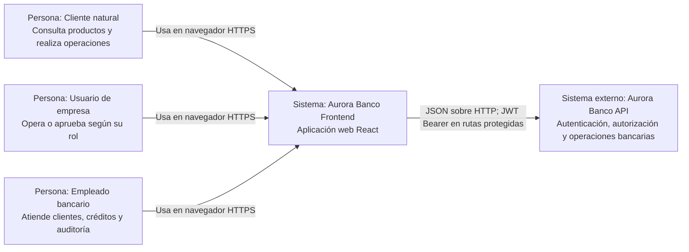

# C4 - Nivel 1: Contexto del frontend

## Propósito y alcance

Aurora Banco Frontend es la aplicación web con la que clientes y empleados interactúan con las capacidades bancarias expuestas por el backend. Presenta las funciones permitidas para cada rol, recoge datos de entrada y muestra resultados, errores y estados de las operaciones. No calcula ni persiste saldos por cuenta propia y no se conecta directamente a las bases de datos.

Este nivel muestra quién usa el frontend y con qué sistemas externos se comunica. Los límites internos de despliegue están en [C4-2-Contenedores.md](C4-2-Contenedores.md).

## Diagrama de contexto

## Actores

La interfaz diferencia los siguientes perfiles autenticados: `NATURAL_CUSTOMER`, `BUSINESS_CUSTOMER`, `BUSINESS_OPERATOR`, `BUSINESS_SUPERVISOR`, `TELLER_EMPLOYEE`, `COMMERCIAL_EMPLOYEE` e `INTERNAL_ANALYST`. Los usuarios no autenticados pueden acceder a inicio de sesión y a los flujos públicos de registro.

Las personas representan capacidades de uso, no tipos de cuenta de React. La navegación concreta se resuelve a partir del rol recibido durante la autenticación.

## Relaciones y límites de confianza

- El navegador descarga la aplicación y ejecuta sus componentes React localmente.
- El frontend usa la API configurada mediante `VITE_API_BASE_URL`; en el entorno local el valor es `http://localhost:8080`.
- Las peticiones autenticadas incluyen el token de acceso como `Authorization: Bearer <token>`; las rutas públicas no lo requieren.
- El backend es autoridad para validar identidad, permisos y reglas bancarias. Las rutas protegidas del frontend mejoran la navegación, pero no reemplazan la autorización del servidor.
- El frontend no debe conocer credenciales de bases de datos ni secretos de firma JWT. La comunicación del navegador con el backend está sujeta a CORS.
- Las bases de datos y su persistencia pertenecen al backend; no son dependencias directas del navegador.

## Flujos representativos

1. Un usuario abre el frontend, inicia sesión y recibe una sesión autenticada.
2. El frontend selecciona la página inicial correspondiente al rol.
3. Una pantalla solicita los datos necesarios a servicios de aplicación, que usan el adaptador HTTP para comunicarse con la API.
4. La interfaz representa los estados de carga, éxito, vacío o error. Para operaciones sensibles solicita confirmación y muestra el resultado.
5. Si una petición protegida recibe `401`, la sesión local se limpia y el usuario vuelve al inicio de sesión. Un `403` no debe cambiar el rol ni fingir autorización.

## Referencias

- [Arquitectura frontend](Frontend-Architecture.md)
- [Adaptadores frontend](Frontend-Adapters.md)
- [Flujos de usuario](Frontend-User-Flows.md)