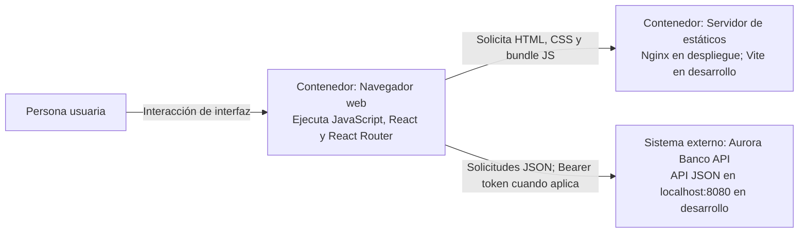

# C4 - Nivel 2: Contenedores del frontend

## Alcance

Este nivel descompone el sistema frontend en unidades ejecutables y desplegables. En producción, el bundle construido se sirve como archivos estáticos por Nginx y se ejecuta en el navegador del usuario. En desarrollo, Vite entrega esos archivos y permite la recarga rápida. El navegador llama directamente a la API; Nginx y Vite no actúan como proxy de negocio.

## Diagrama de contenedores

## Contenedores

| Contenedor | Responsabilidad | Tecnología y ubicación |
|---|---|---|
| Aplicación cliente | Ejecutar la interfaz, rutas, estado de UI y coordinación de casos de uso. | React 19, TypeScript y React Router 7; JavaScript ejecutado dentro del navegador. |
| Servidor de archivos estáticos | Publicar `index.html`, CSS, recursos y bundle generado. | Nginx en la etapa runtime de `frontend/Dockerfile`; Vite durante desarrollo (`npm run dev`, puerto 5173). |
| API bancaria | Autenticar, autorizar, validar reglas y ejecutar operaciones persistentes. | Servicio backend independiente; dirección de desarrollo `http://localhost:8080`. No pertenece al despliegue del frontend. |

## Configuración y comunicación

- Vite sustituye `VITE_API_BASE_URL` durante la compilación. Si no está configurada, el adaptador HTTP usa `http://localhost:8080`.
- Compose publica el contenedor Nginx del frontend en el puerto de host `5173` (puerto `80` del contenedor).
- El navegador llama a la API con su propia URL. Por ello la API debe aceptar el origen del frontend mediante CORS.
- El adaptador HTTP serializa JSON, genera y propaga `X-Request-Id`, agrega el JWT a solicitudes protegidas, controla timeout/cancelación y traduce errores HTTP a errores del dominio frontend.
- El navegador mantiene la sesión según el adaptador de sesión. Los detalles de esa política deben seguir el código y el contrato vigente; nunca se guardan contraseñas ni secretos del backend.

## Construcción y arranque

La imagen Docker usa una etapa Node para instalar dependencias reproducibles y ejecutar `npm run build` (TypeScript y Vite). La etapa final copia `dist/` a Nginx, que sirve los archivos sin ejecutar lógica de aplicación en el servidor. En modo desarrollo, `vite.config.ts` activa el plugin de React y ofrece el servidor Vite.

## Decisiones y límites

- React es una aplicación cliente de página única (SPA): las rutas cambian dentro del navegador y React Router muestra las páginas sin pedir al servidor un HTML diferente por cada ruta.
- No hay una capa servidor-a-servidor para las llamadas API en el frontend actual.
- El origen del backend debe configurarse para el entorno de compilación. Cambiar variables `VITE_*` después de construir no reconfigura un bundle ya generado.
- No se debe interpretar el contenedor estático como una frontera de seguridad: autorización y reglas de negocio permanecen en el backend.

## Referencias

- `frontend/Dockerfile`
- `frontend/vite.config.ts`
- `docker-compose.yml`
- [Adaptadores frontend](Frontend-Adapters.md)