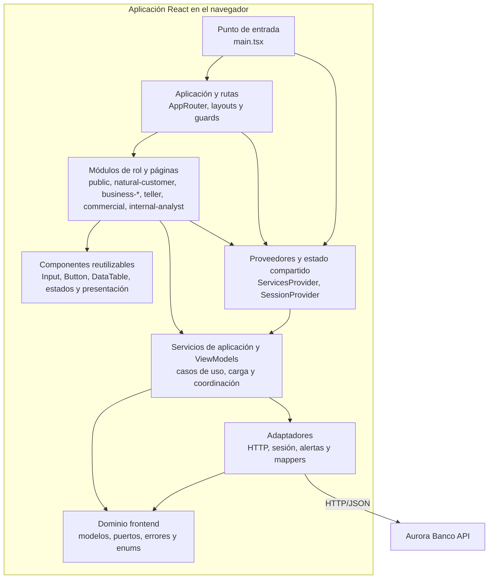

# C4 - Nivel 3: Componentes del frontend

## Alcance

Este nivel describe las piezas principales dentro de la aplicación cliente y sus dependencias. Las cajas representan responsabilidades del código fuente; no son procesos independientes. La dirección de dependencias evita que las pantallas construyan URLs o manipulen tokens directamente.

## Diagrama de componentes

## Componentes y responsabilidades

| Componente | Ubicación representativa | Responsabilidad |
|---|---|---|
| Punto de entrada | `frontend/src/main.tsx` | Crea los servicios una vez y monta el árbol React dentro del elemento `#root`, con los límites globales y proveedores. |
| Enrutamiento y shell | `frontend/src/app/` | Define rutas públicas y protegidas, el layout autenticado, navegación por rol y estados de ruta no encontrada. |
| Guards | `frontend/src/app/guards/` | Comprueban sesión y rol para decidir qué rama de UI mostrar; la API conserva la autorización efectiva. |
| Estado compartido y acceso a servicios | `frontend/src/application/session/SessionProvider.tsx` | Publica sesión, operaciones de login/logout y servicios a través de React Context y hooks. |
| Módulos de rol | `frontend/src/modules/` | Componen páginas y flujos orientados a los roles del dominio. Las páginas conectan datos, acciones y componentes de presentación. |
| Componentes comunes | `frontend/src/components/` | Controles y piezas visuales reutilizables, como campos accesibles, botones, tablas, importes, badges, skeletons y estados vacíos. |
| Servicios de aplicación y ViewModels | `frontend/src/application/` | Orquestan operaciones del usuario, traducen las necesidades de la UI a puertos y encapsulan estados de recursos remotos reutilizables. |
| Dominio | `frontend/src/domain/` | Define roles, modelos, errores y puertos sin depender del DOM ni de la implementación HTTP. |
| Adaptadores | `frontend/src/adapters/` | Implementan transporte HTTP, sesión del navegador, alertas y mapeos. El adaptador HTTP es el único que ejecuta `fetch`. |

## Colaboración en una consulta

1. React Router selecciona una página del módulo a partir de la URL y los guards consultan la sesión compartida.
2. La página obtiene servicios de contexto y crea/usa un recurso asíncrono para pedir datos.
3. El servicio de aplicación llama al puerto HTTP con una operación tipada y una ruta definida por el contrato.
4. El adaptador HTTP incorpora encabezados, token y `X-Request-Id`, ejecuta `fetch` y convierte una respuesta no exitosa a un error tipado.
5. El resultado vuelve a la página/ViewModel; una actualización de estado provoca que React vuelva a calcular la UI afectada.
6. La página presenta éxito, vacío, carga o error mediante componentes compartidos y conserva disponibles las acciones de reintento que correspondan.

## Colaboración durante autenticación y expiración

- El servicio de autenticación envía credenciales al endpoint público.
- La página solicita `signIn` al `SessionProvider`; este guarda la sesión mediante el adaptador y refleja la sesión en Context.
- El destino se calcula por rol y React Router cambia la ruta.
- Una respuesta `401` en petición protegida hace que el adaptador limpie la sesión y notifique el evento. El proveedor actualiza el estado React y las rutas protegidas redirigen a login.
- Una respuesta `403` conserva la sesión y presenta una alerta; no transforma la identidad del usuario.

## Reglas de dependencia

- `domain` no importa React, browser APIs ni detalles HTTP.
- Los módulos pueden depender de servicios, hooks de sesión y componentes comunes; no deben implementar transporte.
- Los componentes genéricos reciben props y callbacks y no deben leer configuración de API ni token.
- El acceso a APIs externas está encapsulado en adaptadores y servicios.
- Las páginas deben tratar por separado carga, éxito, vacío y error cuando consumen recursos remotos.

## Referencias

- [Arquitectura frontend](Frontend-Architecture.md)
- [Servicios de dominio y aplicación](Frontend-Domain-Services.md)
- [Adaptadores frontend](Frontend-Adapters.md)
- [Flujos por rol](Frontend-Role-Modules.md)
- [C4 nivel 4: código y React](C4-4-Codigo-React.md)