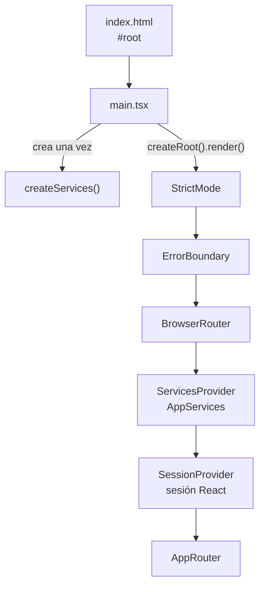
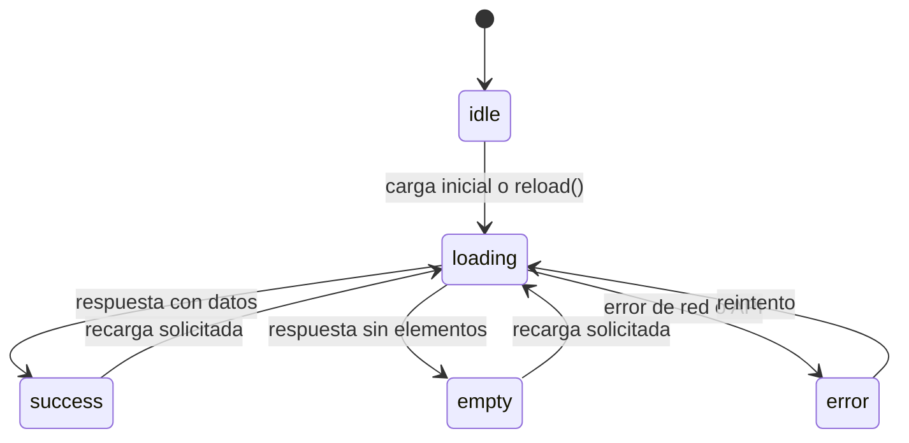
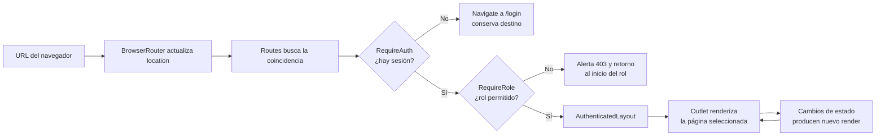
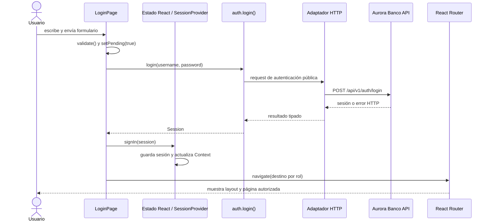

# C4 - Nivel 4: Código y funcionamiento de React

## Alcance y guía de lectura

El nivel 4 baja desde los componentes arquitectónicos hasta archivos, funciones, hooks y relaciones concretas. En este frontend, React 19 con TypeScript define el árbol de UI; React Router 7 resuelve navegación cliente; Vite compila TSX y publica los recursos. Las rutas hexagonales (`domain`, `application`, `adapters`, `modules`) son límites del código de la aplicación, no capas internas propias de React.

Este documento explica el flujo que realmente ejecuta la aplicación. Los nombres de archivos corresponden al código bajo `frontend/src/`.

## 1. Arranque: desde HTML hasta el árbol React

`frontend/index.html` ofrece el elemento raíz `#root` y carga el módulo de entrada `src/main.tsx`. El punto de entrada construye una sola instancia de servicios y luego monta el árbol:



### Qué hace cada paso

1. `createServices()` en `application/container.ts` instancia adaptadores y servicios. Se ejecuta fuera de los componentes, así que un render de React no vuelve a crear el cliente HTTP ni la sesión.
2. `createRoot(...).render(...)` enlaza React con el nodo DOM administrado por la aplicación. React toma el árbol JSX inicial y mantiene sus cambios posteriores.
3. `StrictMode` activa comprobaciones adicionales de desarrollo para detectar efectos secundarios y patrones inseguros. No es un proveedor de datos ni debe usarse para inferir que se realizan dos solicitudes en producción.
4. `ErrorBoundary` captura errores de renderizado descendientes y permite presentar una recuperación en vez de dejar que un error de componente derribe silenciosamente toda la interfaz.
5. `BrowserRouter` observa la URL del navegador y publica la ubicación actual para que `Routes`, `Link`, `NavLink`, `Navigate` y los hooks de navegación coordinen una SPA.
6. `ServicesProvider` expone la instancia `AppServices`; `SessionProvider` depende de ese contexto y publica el estado compartido de autenticación.
7. `AppRouter` construye las ramas públicas, autenticadas y por rol.

El orden de los providers importa: `SessionProvider` usa `useServices()`, por tanto necesita estar bajo `ServicesProvider`; los guards y páginas que llaman `useSession()` deben estar bajo `SessionProvider`; las funciones de navegación requieren el router.

## 2. JSX, componentes y composición

Un componente funcional es una función TypeScript que recibe props, puede leer contexto/hooks y devuelve JSX. JSX describe elementos y componentes; el plugin de React/Vite lo transforma durante el build en llamadas que React puede reconciliar con el árbol previo.

La UI se compone en varios niveles:

- `AppRouter` elige la página según ubicación y estado de acceso.
- Las páginas de `modules/` ensamblan secciones y conectan acciones con servicios.
- `components/` contiene controles reutilizables y piezas de presentación con props explícitas.
- El DOM real se actualiza como resultado del render de React; las páginas no necesitan crear manualmente nodos para cada cambio.

Por ejemplo, `Input` recibe `label`, `hint`, `error` y el resto de atributos nativos. Usa `useId()` para producir un identificador estable por instancia y conecta el `<label>` al campo mediante `htmlFor`. Vincula mensajes con `aria-describedby`, indica errores con `aria-invalid` y renderiza el mensaje como alerta accesible. La validación y el estado del valor pertenecen al formulario que consume el componente, no al control genérico.

## 3. Estado: local frente a compartido

### Estado local de pantalla

`useState` conserva datos que solo necesita una instancia de componente y cuya actualización debe refrescar su UI. En `LoginPage`, por ejemplo, existen estados independientes para usuario, contraseña, errores de validación, envío pendiente y transición visual:

```text
username/password -> valores editables del formulario
errors            -> errores de validación local
pending            -> bloquea envíos duplicados y desactiva campos
transitioning      -> representa el paso visual previo a navegar
```

El formulario es controlado: `value` recibe el estado y `onChange` lo actualiza. Al escribir, React programa una nueva renderización; el JSX vuelve a evaluarse con el valor actualizado y React aplica la diferencia necesaria al DOM. `onSubmit` previene el envío HTML por defecto, valida primero, cambia `pending`, llama al servicio y actualiza la pantalla según resultado.

### Estado compartido por Context

`SessionProvider` mantiene `session` y `expiredNotice` con `useState`. Publica el valor mediante `SessionContext.Provider`; `useSession()` consume ese valor desde páginas, layout y guards. `ServicesProvider` expone por separado los servicios y `useServices()` los recupera.

Context evita pasar la sesión y los servicios manualmente por cada nivel de props. Cuando cambia el valor del proveedor, los consumidores de ese contexto pueden volver a renderizarse para mostrar el estado más reciente. Context no es almacenamiento persistente: la persistencia y lectura pasan por `services.session`.

### Estado remoto

Los datos provenientes de la API no se deben confundir con sesión ni con el estado transitorio de un formulario. Las páginas usan hooks de `application/viewModels` como `useAsyncResource` para representar ciclo de carga, resultado, vacío/error, actualización y reintento. Un hook encapsula lógica reutilizable entre componentes, conserva el estado en la instancia que lo invoca y permite que la página traduzca ese estado a skeletons, tarjetas, tablas o alertas.

En `NaturalCustomerDashboard`, perfil y cuentas se solicitan como recursos separados. La carga de operaciones depende de que exista la cuenta principal; la cuenta elegida se deriva de los datos recibidos. Así, un fallo de una sección no obliga a ocultar toda la pantalla y cada widget puede exponer su propio reintento.



La página representa cada estado con un componente distinto; la transición de estado ocurre en el hook del recurso, y React vuelve a evaluar el JSX consumidor.

## 4. Hooks y efectos: responsabilidades

- `useState` modela estado local que participa en el render.
- `useContext` lee servicios y sesión desde los providers.
- `useNavigate`, `useLocation` y `NavLink` integran estado de ruta con UI sin recarga completa del documento.
- `useEffect` sincroniza React con sistemas externos después del render. En `SessionProvider` instala y retira un listener `storage` y conecta/desconecta la notificación global que recibe eventos del adaptador HTTP. En `RequireRole`, ejecuta una alerta cuando la sesión existe pero no tiene el rol requerido.
- `useCallback` mantiene funciones de notificación estables según sus dependencias; `useMemo` construye el objeto de valor del contexto a partir de sus dependencias; `useRef` guarda una marca de expiración que no necesita por sí sola renderizar la UI.
- Todo efecto que instala un listener debe devolver una limpieza para retirar ese listener. React vuelve a ejecutar efectos cuando cambian sus dependencias y los limpia al desmontar o antes de volver a sincronizarlos.

Los hooks solo pueden invocarse en el nivel superior de componentes funcionales o hooks propios, no condicionalmente ni dentro de ciclos. Este orden constante permite que React asocie cada estado con la misma posición de hook en cada render.

## 5. Renderizado y navegación

`AppRouter` declara rutas con `Routes` y `Route`. Las páginas públicas (`/login` y registros) pueden mostrarse sin una sesión. Las rutas autenticadas se anidan bajo `RequireAuth` y `AuthenticatedLayout`; dentro del layout, cada grupo se anida en un `RequireRole` y expone una o más páginas.

Los guards son componentes que deciden entre:

- devolver `<Navigate>` para cambiar de ruta;
- devolver `<Outlet>` para renderizar la ruta hija;
- o no renderizar la operación solicitada.

El ciclo de navegación y render se puede leer así:



`AuthenticatedLayout` permanece como shell común alrededor de la página hija. Su `<Outlet>` es el punto donde React Router coloca la pantalla activa. `useLocation()` determina ruta y breadcrumb; `useState` abre/cierra navegación móvil; `NavLink` representa enlaces y estado activo. En `main`, la `key` basada en `location.pathname` hace que el contenido principal se remonte al cambiar de ruta, lo que también reinicia el estado local de esa página.

Para un usuario sin sesión, `RequireAuth` conserva la ruta de destino en `location.state` y redirige a `/login`. Tras iniciar sesión, `LoginPage` usa la ruta guardada si existe; si no, calcula el inicio con `ROLE_HOME[session.user.role]`. `RequireRole` compara el rol autenticado con los permitidos y redirige al inicio propio si hay discrepancia.

La interfaz de rol es control de navegación y experiencia, no una frontera de seguridad. Un usuario puede manipular el cliente; todos los permisos y las operaciones deben validarse también en el backend.

## 6. Ejemplo completo: inicio de sesión

```text
1. El usuario escribe en campos controlados de LoginPage.
2. onSubmit previene el submit del navegador y ejecuta validate().
3. Si hay errores, setErrors() solicita render con mensajes y no hace HTTP.
4. Si el formulario es válido, setPending(true) desactiva controles y evita reenvío accidental.
5. services.auth.login() ejecuta el caso de uso mediante el adaptador HTTP.
6. El HTTP adapter hace fetch, analiza la respuesta y devuelve la sesión o lanza un error tipado.
7. En éxito, signIn(session) pide al adaptador guardar la sesión y actualiza SessionContext.
8. LoginPage determina el destino por ruta previa o rol, muestra la transición y navega.
9. El router vuelve a evaluar la URL, RequireAuth/RequireRole permiten la rama apropiada y el layout representa su Outlet.
10. En error, la alerta central presenta el problema, se conserva el usuario y se limpia la contraseña; finally restablece pending.
```

La interacción entre el componente, los servicios, la sesión y la API se muestra en esta secuencia:



Si la API responde con error, la respuesta regresa al componente como excepción tipada; la página presenta el error, conserva el usuario, limpia la contraseña y restablece `pending` en `finally`.

La secuencia es asíncrona, pero React no bloquea el hilo esperando la red: el navegador procesa la respuesta al resolverse la promesa y cada `setState` solicita el render que refleja el nuevo estado. El servicio y adaptador aíslan transporte de la vista.

## 7. Ejemplo completo: consulta de dashboard

`NaturalCustomerDashboard` obtiene `services` y `session` desde `useSession()`, y el objeto de navegación desde `useNavigate()`. Cada invocación de `useAsyncResource` crea un estado para un recurso y acepta una función que llama a un servicio de aplicación. Cuando la promesa cambia el estado del hook, React vuelve a ejecutar el componente.

El JSX evalúa el `status` del recurso y selecciona la representación:

- `loading`: skeleton con semántica de estado;
- `error`: error visible y acción `reload`;
- `empty`: estado vacío con orientación contextual;
- `success`: lista de tarjetas derivada de los datos.

La lista utiliza `accountNumber` como `key`, identificador estable que ayuda a React a asociar cada elemento entre renderizaciones. Los handlers de botones llaman `navigate()`; la pantalla no construye URLs API ni llama directamente a `fetch`.

## 8. Errores, sesión y límites del browser

El adaptador HTTP convierte códigos/status a errores del frontend. Si una petición protegida recibe `401`, limpia la sesión mediante `SessionPort` y envía un evento. La integración del `SessionProvider` actualiza Context; el router renderiza la redirección y el aviso de expiración. En `403`, se conserva la sesión y se presenta una alerta de autorización.

El `storage` event sincroniza cambios del almacenamiento entre documentos/pestañas del mismo origen; el provider vuelve a leer la sesión a través del puerto. El componente React no lee ni escribe directamente tokens. Esta separación limita el acoplamiento del UI con mecanismos del navegador.

Los errores de render y los errores de solicitudes son rutas diferentes: `ErrorBoundary` atiende fallos de renderizado descendiente; los errores de red/API se manejan en los servicios, hooks de recursos y adaptador de alertas.

## 9. Accesibilidad y estructura de UI

- Los controles reutilizables reciben atributos HTML estándar mediante props tipadas.
- `Input` enlaza etiqueta y control, y relaciona hint/error con `aria-describedby`.
- Estados de carga, menús y errores usan roles y propiedades ARIA cuando corresponde.
- Las listas renderizadas deben tener `key` estable; no usar índices si existe identidad de dominio estable.
- Las acciones son callbacks explícitos del padre, lo que permite separar presentación y comportamiento.

## 10. Build y pruebas relacionadas

- `vite.config.ts` registra `@vitejs/plugin-react`; el build compila el proyecto TypeScript y genera el bundle estático.
- Vitest ejecuta pruebas de componentes en `jsdom` con `src/test/setup.ts`; las pruebas viven junto a `src/**/*.test.{ts,tsx}`.
- React Testing Library puede verificar comportamiento observable del usuario (texto, formularios, accesibilidad y navegación) sin acoplar pruebas a detalles internos del DOM.
- Las pruebas live y la captura de screenshots son verificaciones adicionales del contrato HTTP y del flujo visual; no reemplazan pruebas unitarias de servicios ni validaciones backend.

Comandos de validación admitidos y requisitos de Docker están descritos en `frontend/INSTRUCTIONS.md`; el repositorio prohíbe ejecutar npm, Vite o Vitest directamente en el host.

## Archivos de referencia

- `frontend/src/main.tsx`
- `frontend/src/application/container.ts`
- `frontend/src/application/session/SessionProvider.tsx`
- `frontend/src/app/AppRouter.tsx`
- `frontend/src/app/guards/guards.tsx`
- `frontend/src/app/AuthenticatedLayout.tsx`
- `frontend/src/modules/public/LoginPage.tsx`
- `frontend/src/modules/natural-customer/DashboardPage.tsx`
- `frontend/src/components/Input.tsx`
- `frontend/src/adapters/http/httpAdapter.ts`